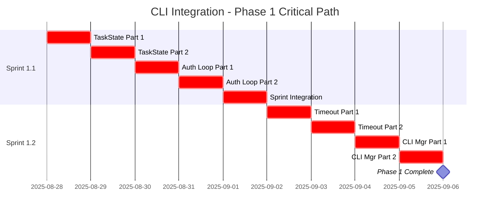
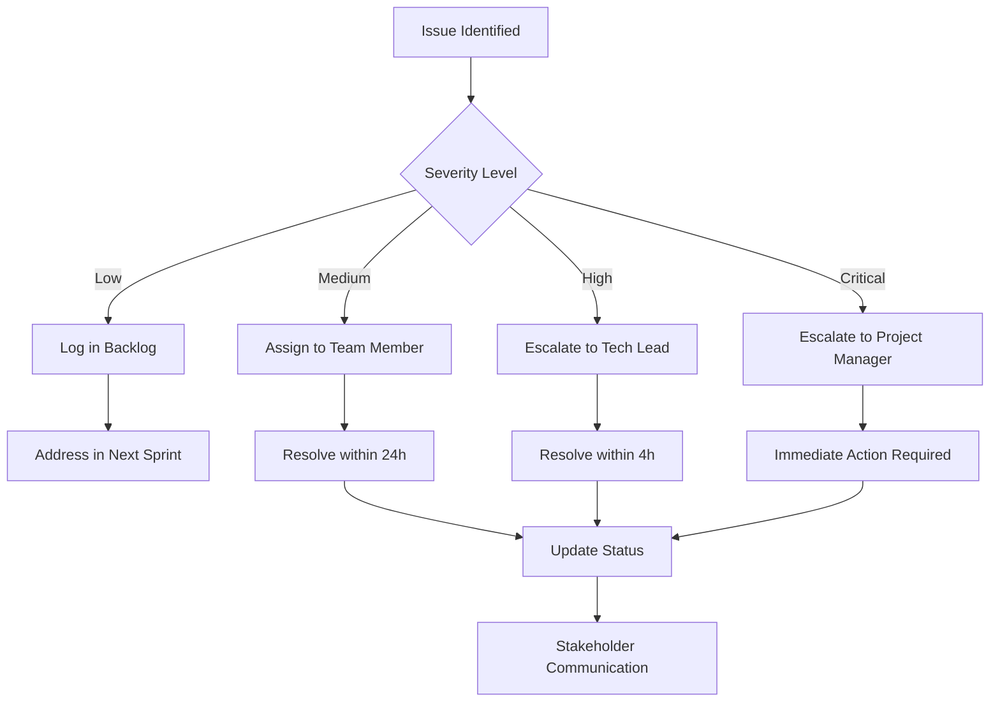

# CLI Integration Stabilization - Project Management Plan

## Executive Summary

This document provides the comprehensive project management structure for the CLI Integration Stabilization project, implementing the specifications-engineer's 5-phase approach with detailed sprint planning, team organization, and tracking mechanisms.

**Project Timeline**: 50 days (10 weeks) across 5 phases
**Team Size**: 4-8 people depending on phase
**Critical Success Factor**: Phase 1 completion blocks all subsequent phases

---

## Phase 1: Critical Stabilization - Detailed Sprint Plan
**Duration**: Days 1-10 (2 weeks)
**Objective**: Resolve immediate blockers preventing system operation
**Team Size**: 2 senior engineers (full-time)

### Sprint 1.1: TaskState & Authentication (Days 1-5)

#### Day 1: TaskState Unification - Part 1
**Jira Ticket**: CLI-001

**Story**: As a developer, I need a single TaskState definition so that all modules can import without errors

**Tasks**:
- [ ] **CLI-001-01** (2h): Audit all TaskState definitions across codebase
- [ ] **CLI-001-02** (3h): Create canonical `orchestrator/models/states.py`
- [ ] **CLI-001-03** (2h): Implement TaskState enum with helper methods
- [ ] **CLI-001-04** (1h): Write unit tests for TaskState functionality

**Acceptance Criteria**:
- [ ] Single TaskState definition in `orchestrator/models/states.py`
- [ ] All states from existing definitions included
- [ ] Helper methods `is_terminal()` and `is_active()` implemented
- [ ] Unit tests achieve 100% coverage

**Definition of Done**:
- [ ] Code reviewed by senior engineer
- [ ] All tests passing
- [ ] No import errors when importing TaskState
- [ ] Documentation updated

#### Day 2: TaskState Unification - Part 2
**Jira Ticket**: CLI-002

**Story**: As a system administrator, I need all modules to use the canonical TaskState so that there are no runtime conflicts

**Tasks**:
- [ ] **CLI-002-01** (4h): Update all imports to use canonical definition
- [ ] **CLI-002-02** (2h): Remove duplicate TaskState definitions
- [ ] **CLI-002-03** (1h): Create migration script for existing task data
- [ ] **CLI-002-04** (1h): Verify no import errors across entire system

**Acceptance Criteria**:
- [ ] All modules import from `orchestrator.models.states`
- [ ] No duplicate TaskState definitions remain
- [ ] Migration script handles existing data
- [ ] System starts without import errors

**Definition of Done**:
- [ ] Integration tests passing
- [ ] Migration tested on sample data
- [ ] All modules use canonical import
- [ ] System smoke test passes

#### Day 3: Authentication Loop Resolution - Part 1
**Jira Ticket**: CLI-003

**Story**: As a user, I need authentication to complete within reasonable time so that I can use the CLI system

**Tasks**:
- [ ] **CLI-003-01** (3h): Create `AuthenticationManager` class with retry logic
- [ ] **CLI-003-02** (2h): Implement exponential backoff algorithm
- [ ] **CLI-003-03** (2h): Define retryable vs non-retryable error types
- [ ] **CLI-003-04** (1h): Add comprehensive logging for auth attempts

**Acceptance Criteria**:
- [ ] AuthenticationManager handles retry logic
- [ ] Maximum 3 retry attempts with exponential backoff
- [ ] Clear distinction between retryable and non-retryable errors
- [ ] Detailed logging for troubleshooting

**Definition of Done**:
- [ ] Unit tests for all retry scenarios
- [ ] Error handling tested and documented
- [ ] Code review completed
- [ ] Performance tested (no blocking)

#### Day 4: Authentication Loop Resolution - Part 2
**Jira Ticket**: CLI-004

**Story**: As a system operator, I need authentication failures to not consume system resources so that the system remains stable

**Tasks**:
- [ ] **CLI-004-01** (3h): Implement circuit breaker pattern
- [ ] **CLI-004-02** (2h): Add timeout handling for auth attempts
- [ ] **CLI-004-03** (2h): Create `AuthResult` class for structured responses
- [ ] **CLI-004-04** (1h): Integration testing with existing CLI providers

**Acceptance Criteria**:
- [ ] Circuit breaker prevents infinite retries
- [ ] 30-second timeout per authentication attempt
- [ ] Structured AuthResult with success/error details
- [ ] Works with all existing CLI providers

**Definition of Done**:
- [ ] Load testing shows no resource exhaustion
- [ ] Integration tests pass with all providers
- [ ] Circuit breaker metrics exposed
- [ ] Documentation complete

#### Day 5: Sprint 1.1 Integration & Testing
**Jira Ticket**: CLI-005

**Story**: As a project manager, I need confirmation that TaskState and Authentication fixes work together so that we can proceed to Sprint 1.2

**Tasks**:
- [ ] **CLI-005-01** (2h): End-to-end testing of TaskState usage
- [ ] **CLI-005-02** (2h): Integration testing of authentication flow
- [ ] **CLI-005-03** (2h): Performance testing under load
- [ ] **CLI-005-04** (2h): User acceptance testing with real scenarios

**Acceptance Criteria**:
- [ ] No TaskState import errors in any scenario
- [ ] Authentication completes within 90 seconds maximum
- [ ] System handles 10 concurrent authentication attempts
- [ ] All existing functionality still works

**Definition of Done**:
- [ ] All Sprint 1.1 acceptance criteria met
- [ ] System passes smoke test
- [ ] Performance benchmarks documented
- [ ] Sprint 1.1 retrospective completed

### Sprint 1.2: Session Management & CLI Consolidation (Days 6-10)

#### Day 6: Session Timeout Standardization - Part 1
**Jira Ticket**: CLI-006

**Story**: As a developer, I need consistent timeout values across all CLI sessions so that behavior is predictable

**Tasks**:
- [ ] **CLI-006-01** (2h): Create centralized `config/timeouts.yaml`
- [ ] **CLI-006-02** (3h): Implement `TimeoutManager` class
- [ ] **CLI-006-03** (2h): Add warning notifications before timeout
- [ ] **CLI-006-04** (1h): Create timeout configuration validation

**Acceptance Criteria**:
- [ ] Single timeout configuration file
- [ ] TimeoutManager handles all timeout scenarios
- [ ] 30-second warning before timeout
- [ ] Configuration validates on startup

**Definition of Done**:
- [ ] All timeout values centralized
- [ ] TimeoutManager tested for all scenarios
- [ ] Warning system functional
- [ ] Configuration schema documented

#### Day 7: Session Timeout Standardization - Part 2
**Jira Ticket**: CLI-007

**Story**: As a user, I need session timeouts to be reset by activity so that active sessions don't terminate unexpectedly

**Tasks**:
- [ ] **CLI-007-01** (3h): Implement timer reset on activity
- [ ] **CLI-007-02** (2h): Add session lifetime management
- [ ] **CLI-007-03** (2h): Update all session references to use TimeoutManager
- [ ] **CLI-007-04** (1h): Add timeout metrics and monitoring

**Acceptance Criteria**:
- [ ] Activity resets idle timeout
- [ ] Maximum session lifetime enforced (1 hour)
- [ ] All sessions use centralized timeout management
- [ ] Timeout events logged and monitored

**Definition of Done**:
- [ ] End-to-end timeout testing complete
- [ ] All legacy timeout code removed
- [ ] Metrics dashboard shows timeout activity
- [ ] User documentation updated

#### Day 8: CLI Manager Consolidation - Part 1
**Jira Ticket**: CLI-008

**Story**: As a maintainer, I need a single CLI manager implementation so that there's no confusion about which one to use

**Tasks**:
- [ ] **CLI-008-01** (4h): Create `UnifiedCLIManager` combining all functionality
- [ ] **CLI-008-02** (2h): Integrate ProcessManager, SessionManager, and AuthManager
- [ ] **CLI-008-03** (1h): Map all existing API calls to unified interface
- [ ] **CLI-008-04** (1h): Create comprehensive unit tests

**Acceptance Criteria**:
- [ ] Single UnifiedCLIManager class
- [ ] All functionality from three managers available
- [ ] Clean, documented API interface
- [ ] Complete unit test coverage

**Definition of Done**:
- [ ] Code review by architect
- [ ] API documentation complete
- [ ] All unit tests passing
- [ ] Performance equivalent to best existing manager

#### Day 9: CLI Manager Consolidation - Part 2
**Jira Ticket**: CLI-009

**Story**: As a system user, I need existing functionality to work with the new unified manager so that there's no service disruption

**Tasks**:
- [ ] **CLI-009-01** (3h): Write migration script for active sessions
- [ ] **CLI-009-02** (2h): Update all references to use UnifiedCLIManager
- [ ] **CLI-009-03** (2h): Test migration with real sessions
- [ ] **CLI-009-04** (1h): Archive old manager implementations

**Acceptance Criteria**:
- [ ] Zero-downtime migration possible
- [ ] All API endpoints use unified manager
- [ ] Active sessions migrate successfully
- [ ] Old implementations safely archived

**Definition of Done**:
- [ ] Migration tested in staging
- [ ] All integration tests pass
- [ ] Old code moved to archive
- [ ] Rollback procedure documented

#### Day 10: Phase 1 Integration Testing & Completion
**Jira Ticket**: CLI-010

**Story**: As a project stakeholder, I need confirmation that all Phase 1 objectives are met so that Phase 2 can begin

**Tasks**:
- [ ] **CLI-010-01** (2h): Execute complete integration test suite
- [ ] **CLI-010-02** (2h): Performance testing and benchmarking
- [ ] **CLI-010-03** (2h): User acceptance testing
- [ ] **CLI-010-04** (2h): Phase 1 completion review and documentation

**Acceptance Criteria**:
- [ ] All Phase 1 acceptance criteria met
- [ ] System performance meets baselines
- [ ] User workflows function correctly
- [ ] Phase 1 retrospective completed

**Definition of Done**:
- [ ] Stakeholder sign-off received
- [ ] Phase 1 report delivered
- [ ] Phase 2 resources allocated
- [ ] System ready for Phase 2 work

---

## Team Structure and RACI Matrix

### Core Team Roles

#### Phase 1 Team Structure
**Team Size**: 4 people
**Duration**: 2 weeks full-time

| Role | Name/Assignment | Responsibilities | Availability |
|------|-----------------|------------------|--------------|
| **Technical Lead** | TBD | Architecture decisions, code reviews, escalation | 100% (2 weeks) |
| **Senior Backend Engineer** | TBD | TaskState, Authentication implementation | 100% (2 weeks) |
| **DevOps Engineer** | TBD | Session management, CLI consolidation | 100% (2 weeks) |
| **QA Engineer** | TBD | Integration testing, acceptance testing | 50% (5 days) |

### RACI Matrix - Phase 1

| Task | Technical Lead | Sr Backend Eng | DevOps Eng | QA Engineer | Project Manager |
|------|----------------|----------------|------------|-------------|-----------------|
| TaskState Unification | R | A | C | I | I |
| Authentication Fixes | R | A | C | I | I |
| Session Timeout | C | R | A | I | I |
| CLI Manager Consolidation | A | C | R | I | I |
| Integration Testing | C | C | C | A | R |
| Phase 1 Sign-off | C | I | I | I | A |

**Legend**: R = Responsible, A = Accountable, C = Consulted, I = Informed

### Extended Team (Phases 2-5)

| Phase | Team Composition | Skills Required |
|-------|------------------|-----------------|
| **Phase 2** | 1 Engineer + 1 Technical Writer | Specification consolidation |
| **Phase 3** | 2 Engineers (full-time) | Code standardization, refactoring |
| **Phase 4** | 1 Engineer + 1 QA Engineer | Testing, validation |
| **Phase 5** | 1 Engineer + 1 DevOps Engineer | Production readiness |

---

## Dependency Management Plan

### Critical Path Analysis



### Task Dependencies

#### Within Phase 1
| Task | Depends On | Dependency Type | Risk Level |
|------|------------|-----------------|------------|
| TaskState Part 2 | TaskState Part 1 | Hard | High |
| Auth Loop Part 1 | TaskState completion | Soft | Medium |
| Auth Loop Part 2 | Auth Loop Part 1 | Hard | High |
| Timeout Part 1 | Auth completion | Soft | Low |
| CLI Manager consolidation | All previous tasks | Soft | Medium |

#### Cross-Phase Dependencies
| Phase | Depends On | Dependency Type | Impact |
|-------|------------|-----------------|--------|
| Phase 2 | Phase 1 complete | Hard | Blocks Phase 2 |
| Phase 3 | Phase 2 spec finalized | Hard | Blocks Phase 3 |
| Phase 4 | Phase 3 code complete | Hard | Blocks Phase 4 |
| Phase 5 | Phase 4 validation | Hard | Blocks Phase 5 |

### Risk Mitigation Strategies

| Risk | Probability | Impact | Mitigation Strategy |
|------|-------------|--------|-------------------|
| TaskState changes break existing code | Medium | High | Comprehensive testing, gradual rollout |
| Authentication changes cause login issues | High | Critical | Parallel implementation, quick rollback |
| Session timeout changes affect user experience | Medium | Medium | User notifications, gradual adjustment |
| CLI manager consolidation introduces bugs | High | High | Extensive testing, staged migration |
| Integration issues discovered late | Medium | High | Daily integration testing |

---

## Project Tracking and KPIs

### Phase 1 Success Metrics

#### Quantitative KPIs
| Metric | Target | Current | Tracking Method |
|--------|--------|---------|----------------|
| TaskState Import Errors | 0 | >10 | Automated testing |
| Authentication Loop Failures | 0 | >5/day | Monitoring dashboard |
| Session Timeout Consistency | 100% | ~60% | Configuration audit |
| CLI Manager Implementations | 1 | 3 | Code analysis |
| Integration Test Pass Rate | 100% | <80% | CI/CD pipeline |
| Code Coverage | >90% | ~70% | Coverage reports |

#### Qualitative KPIs
| Metric | Target | Measurement Method |
|--------|--------|--------------------|
| Team Confidence | High | Daily standup sentiment |
| Code Quality | Excellent | Peer review feedback |
| Documentation Quality | Complete | Stakeholder review |
| User Experience | Improved | User testing feedback |

### Burndown Chart Template

**Sprint 1.1 Burndown (Days 1-5)**
- Total Story Points: 40
- Day 1 Target: 32 remaining
- Day 2 Target: 24 remaining
- Day 3 Target: 16 remaining
- Day 4 Target: 8 remaining
- Day 5 Target: 0 remaining

**Sprint 1.2 Burndown (Days 6-10)**
- Total Story Points: 45
- Daily targets follow similar pattern

### Issue Escalation Process



---

## Resource Allocation and Budget

### Person-Hours Calculation

#### Phase 1 (Days 1-10)
| Role | Daily Hours | Total Days | Total Hours | Hourly Rate | Cost |
|------|-------------|------------|-------------|-------------|------|
| Technical Lead | 8 | 10 | 80 | $150 | $12,000 |
| Sr Backend Engineer | 8 | 10 | 80 | $130 | $10,400 |
| DevOps Engineer | 8 | 10 | 80 | $125 | $10,000 |
| QA Engineer | 8 | 5 | 40 | $100 | $4,000 |
| **Phase 1 Total** | | | **280** | | **$36,400** |

#### Full Project Resource Summary
| Phase | Duration | People | Total Hours | Estimated Cost |
|-------|----------|---------|-------------|----------------|
| Phase 1 | 2 weeks | 4 | 280 | $36,400 |
| Phase 2 | 2 weeks | 2 | 160 | $18,000 |
| Phase 3 | 2 weeks | 2 | 160 | $20,000 |
| Phase 4 | 2 weeks | 2 | 160 | $18,000 |
| Phase 5 | 2 weeks | 2 | 160 | $19,000 |
| **Total Project** | **10 weeks** | **4-8** | **920** | **$111,400** |

### Infrastructure Requirements
| Resource | Phase 1 | Ongoing | Annual Cost |
|----------|---------|---------|-------------|
| Development Environment | Existing | Existing | $0 |
| Staging Environment | Existing | Existing | $0 |
| Production Environment | Setup in Phase 5 | Required | $12,000 |
| Monitoring Tools | Setup in Phase 4 | Required | $6,000 |
| Testing Infrastructure | Enhance in Phase 1 | Required | $3,000 |

---

## Communication Plan

### Daily Communication

#### Daily Standup Template
**Time**: 9:00 AM - 9:15 AM
**Participants**: All team members
**Format**: Round-robin updates

**Agenda Template**:
1. **What did you complete yesterday?**
2. **What will you work on today?**
3. **Any blockers or impediments?**
4. **Any help needed from team members?**
5. **Any risks to today's deliverables?**

#### Daily Standup Questions - Phase 1 Specific
- Are there any import errors or compilation issues?
- Are authentication tests passing?
- Are session timeouts working as expected?
- Any integration issues between components?
- Any questions about the consolidated CLI manager design?

### Weekly Communication

#### Weekly Progress Review
**Time**: Fridays 2:00 PM - 3:00 PM
**Participants**: Team + Project Manager + Key Stakeholders

**Agenda**:
1. **Sprint Progress Review** (15 min)
   - Burndown chart analysis
   - Completed tickets review
   - Upcoming week preview

2. **Technical Deep Dive** (30 min)
   - Architecture decisions made
   - Code quality metrics
   - Integration test results
   - Performance benchmarks

3. **Risk Assessment Update** (10 min)
   - New risks identified
   - Mitigation strategies effectiveness
   - Escalation needs

4. **Stakeholder Questions** (5 min)
   - Q&A session
   - Feedback collection

### Stakeholder Updates

#### Executive Summary Report (Weekly)
**Recipients**: Engineering Manager, Product Manager, CTO
**Format**: Email + Dashboard Link

**Template**:
```
Subject: CLI Integration Phase 1 - Week X Progress

Key Achievements:
- [List major completions]

Metrics:
- Story Points Completed: X/Y
- Tests Passing: X%
- Code Coverage: X%
- Critical Issues: X

Next Week Focus:
- [Key deliverables]

Risks/Issues:
- [Any red/yellow status items]

Dashboard: [Link to project dashboard]
```

### Phase Milestone Communication

#### Phase Completion Review
**Time**: End of each phase
**Duration**: 2 hours
**Participants**: All team members + stakeholders

**Agenda**:
1. **Demonstration** (45 min)
   - Working software demo
   - Before/after comparison
   - User workflow walkthrough

2. **Metrics Review** (30 min)
   - Success criteria assessment
   - KPI achievement review
   - Quality metrics analysis

3. **Retrospective** (30 min)
   - What went well
   - What could be improved
   - Actions for next phase

4. **Next Phase Preview** (15 min)
   - Upcoming work overview
   - Resource needs
   - Timeline confirmation

---

## Success Criteria Checklist - Phase 1 Completion

### Technical Success Criteria
- [ ] **Zero Import Errors**: All TaskState imports work without errors
- [ ] **Authentication Reliability**: No infinite loops, max 3 retries with backoff
- [ ] **Session Consistency**: All sessions use 300-second idle timeout
- [ ] **Single CLI Manager**: Only UnifiedCLIManager in use
- [ ] **Integration Tests Pass**: 100% pass rate on integration test suite
- [ ] **Performance Maintained**: No degradation in response times
- [ ] **Code Quality**: >90% test coverage, all linting passes

### Process Success Criteria
- [ ] **Sprint Completion**: All planned tickets completed
- [ ] **Documentation Updated**: All technical documentation reflects changes
- [ ] **Team Alignment**: All team members understand new architecture
- [ ] **Stakeholder Approval**: Formal sign-off received
- [ ] **Phase 2 Ready**: Team and resources allocated for next phase

### User Success Criteria
- [ ] **No User Impact**: Existing workflows continue to function
- [ ] **Improved Reliability**: Reduced authentication failures
- [ ] **Better Error Messages**: Clear, actionable error messages
- [ ] **Predictable Timeouts**: Users receive warnings before timeout

---

## Immediate Action Items (Next 24 Hours)

### Project Manager Actions
1. **Resource Allocation** (2 hours)
   - [ ] Identify and assign Technical Lead
   - [ ] Assign Senior Backend Engineer
   - [ ] Assign DevOps Engineer  
   - [ ] Schedule QA Engineer for 50% time

2. **Project Setup** (2 hours)
   - [ ] Create Jira project with all Phase 1 tickets
   - [ ] Set up daily standup recurring meeting
   - [ ] Configure project dashboard and burndown charts
   - [ ] Set up Slack channel for team communication

3. **Stakeholder Communication** (1 hour)
   - [ ] Send project kickoff announcement
   - [ ] Schedule weekly progress reviews
   - [ ] Confirm Phase 1 completion review date

### Technical Lead Actions
1. **Environment Setup** (2 hours)
   - [ ] Review current codebase for TaskState usage
   - [ ] Set up development branch for Phase 1 work
   - [ ] Configure CI/CD for new tests
   - [ ] Prepare code review guidelines

2. **Team Preparation** (2 hours)
   - [ ] Review specifications with team
   - [ ] Assign initial tickets to team members
   - [ ] Set up pair programming sessions if needed
   - [ ] Create technical design documents for complex tasks

### Day 1 Launch Checklist
- [ ] All team members identified and notified
- [ ] First daily standup scheduled for 9:00 AM
- [ ] Jira tickets CLI-001 through CLI-010 created and assigned
- [ ] Development environment ready for all team members
- [ ] Project dashboard live and accessible
- [ ] Stakeholder communication sent
- [ ] Phase 1 success criteria confirmed with stakeholders

This project management plan ensures the CLI Integration Stabilization project can start immediately with clear ownership, measurable outcomes, and effective tracking mechanisms. The focus on Phase 1 provides the foundation for all subsequent phases while maintaining momentum and stakeholder confidence.