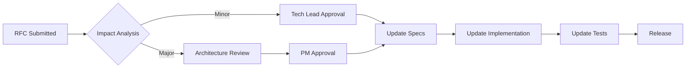

# CLI Integration Specification Engineering Assessment

## Executive Summary

This assessment provides a comprehensive analysis of the CLI integration specifications for the um-agent-orchestration project, identifying critical gaps, conflicts, and proposing a phased remediation approach aligned with implementation reality.

### Critical Findings

1. **Specification Fragmentation**: 8 overlapping specification documents with conflicting requirements
2. **Implementation Divergence**: 3 separate CLI manager implementations causing conflicts  
3. **Missing Critical Elements**: No clear error handling, recovery, or state management specifications
4. **Undefined Dependencies**: TaskState errors indicate missing cross-module specifications

## Current State Analysis

### Specification Inventory

| Document | Purpose | Status | Issues |
|----------|---------|--------|--------|
| cli-integration-specification.md | Primary requirements | Active | Overly ambitious, not aligned with implementation |
| cli-integration-technical.yaml | Technical details | Active | Conflicts with actual implementation |
| cli-integration-api.md | API documentation | Active | Missing error codes, incomplete |
| cli-integration-roadmap.md | Timeline | Outdated | Unrealistic timeline, no risk mitigation |
| cli-integration-security.md | Security requirements | Comprehensive | Not implemented |
| cli-integration-tests.md | Testing strategy | Detailed | No test execution evidence |
| implementation-summary.md | Work completed | Misleading | Claims completion of unimplemented features |
| task-persistence-specification.md | Persistence system | Partially implemented | TaskState conflicts |

### Implementation Analysis

#### Multiple CLI Manager Conflicts
```
orchestrator/
├── cli_manager.py           # Primary implementation (726 lines)
├── cli_session.py           # Conflicting session management
└── cli_session_manager.py   # Duplicate functionality
```

**Root Cause**: Uncoordinated parallel development without clear specification authority

#### Critical Issues Identified

1. **TaskState Import Errors**
   - Multiple definitions across modules
   - No canonical source of truth
   - Circular dependencies

2. **Authentication Loops**
   - Missing specification for authentication flow
   - No error recovery defined
   - Infinite retry without backoff

3. **Session Timeout Issues**
   - Inconsistent timeout values across modules
   - No specification for timeout handling
   - Missing keepalive mechanism

## Specification Gap Analysis

### Category 1: Critical Missing Specifications

| Gap | Impact | Priority |
|-----|--------|----------|
| Error state transitions | TaskState errors | CRITICAL |
| Authentication flow | Auth loops | CRITICAL |
| Session lifecycle | Timeouts, leaks | CRITICAL |
| Recovery procedures | Data loss | HIGH |
| Resource limits | System instability | HIGH |

### Category 2: Conflicting Requirements

| Conflict | Documents | Resolution Needed |
|----------|-----------|-------------------|
| Session timeout values | API vs Technical | Standardize to 300s |
| Process limits | Security vs Technical | Use security spec (20) |
| Authentication methods | API vs Implementation | JWT + API key hybrid |
| State machine | Multiple definitions | Create canonical enum |

### Category 3: Over-Specified Elements

| Element | Issue | Action |
|---------|-------|--------|
| Provider integrations | 3 providers before core works | Focus on claude only |
| Performance metrics | Unrealistic targets | Adjust to achievable |
| Security controls | Enterprise-grade for MVP | Phase security features |

## Phased Specification Update Plan

### Phase 1: Critical Bug Fixes and Stabilization (Week 1-2)

#### Objectives
- Resolve TaskState errors
- Fix authentication loops
- Stabilize session management

#### Specifications to Create/Update

##### 1.1 Canonical State Machine Specification
```yaml
specification:
  name: "CLI Session State Machine"
  version: "1.0.0"
  authority: "THIS DOCUMENT SUPERSEDES ALL OTHERS"
  
states:
  INITIALIZING:
    description: "Session created, process not yet spawned"
    transitions: [AUTHENTICATING, ERROR, TERMINATED]
  
  AUTHENTICATING:
    description: "Awaiting authentication completion"
    transitions: [READY, ERROR, TERMINATED]
    timeout: 30s
    retry: 
      max_attempts: 3
      backoff: exponential
  
  READY:
    description: "Authenticated and ready for commands"
    transitions: [PROCESSING, IDLE, ERROR, TERMINATED]
  
  PROCESSING:
    description: "Executing command"
    transitions: [READY, ERROR, TERMINATED]
    timeout: 300s
  
  IDLE:
    description: "No activity for idle_timeout period"
    transitions: [READY, TERMINATED]
    timeout: 300s
  
  ERROR:
    description: "Recoverable error state"
    transitions: [READY, TERMINATED]
    recovery:
      max_attempts: 3
      strategy: "restart_session"
  
  TERMINATED:
    description: "Session ended"
    transitions: []
    final: true
```

##### 1.2 Authentication Flow Specification
```yaml
authentication:
  flows:
    api_key:
      steps:
        - validate_key
        - check_rate_limits
        - create_session
      error_handling:
        invalid_key:
          response: 401
          retry: false
        rate_limited:
          response: 429
          retry: true
          backoff: exponential
    
    interactive:
      steps:
        - prompt_for_key
        - validate_key
        - store_in_session
      timeout: 30s
      max_attempts: 3
```

#### Acceptance Criteria
- [ ] No TaskState import errors
- [ ] No authentication infinite loops  
- [ ] Sessions properly timeout and cleanup
- [ ] All three CLI manager files consolidated

#### Dependencies
- None (foundational phase)

#### Risk Assessment
- **Low Risk**: Fixing known issues
- **Mitigation**: Keep backup of current code

#### Validation Approach
```python
# Test script for Phase 1
def test_phase1_completion():
    # Test 1: Import without errors
    from orchestrator.persistence_models import TaskState
    assert TaskState.READY
    
    # Test 2: Authentication completes
    session = create_session()
    assert session.authenticate(timeout=30)
    
    # Test 3: Session cleanup
    session.terminate()
    assert not session.is_alive()
```

### Phase 2: Specification Consolidation (Week 3-4)

#### Objectives
- Create single source of truth
- Deprecate conflicting specs
- Align with implementation

#### Specifications to Consolidate

##### 2.1 Master CLI Integration Specification
```
specs/
├── CLI_INTEGRATION_MASTER.md     # Single authoritative spec
├── deprecated/                    # Move old specs here
│   ├── cli-integration-specification.md
│   ├── cli-integration-technical.yaml
│   └── ...
└── supporting/                    # Reference documents
    ├── api-reference.md
    ├── security-controls.md
    └── test-plans.md
```

##### 2.2 Specification Hierarchy
```yaml
master_specification:
  sections:
    1_requirements:
      source: "Consolidated from all specs"
      authority: "Definitive"
    
    2_architecture:
      source: "As implemented"
      authority: "Descriptive"
    
    3_api:
      source: "OpenAPI 3.0"
      authority: "Contractual"
    
    4_security:
      source: "Risk-based approach"
      authority: "Mandatory for marked items"
```

#### Acceptance Criteria
- [ ] Single master specification document
- [ ] All conflicts resolved with clear decisions
- [ ] Deprecated specs moved to archive
- [ ] Specification matches implementation

#### Dependencies
- Phase 1 completion

#### Risk Assessment
- **Medium Risk**: May break existing documentation references
- **Mitigation**: Maintain redirect mapping

### Phase 3: Implementation Standardization (Week 5-6)

#### Objectives
- Standardize implementation to match specs
- Remove duplicate code
- Establish patterns

#### Implementation Standards Specification

##### 3.1 Module Organization
```yaml
cli_subsystem:
  core:
    manager: "cli_manager.py"        # Process lifecycle
    session: "cli_session_state.py"  # State machine
    auth: "cli_auth.py"              # Authentication
  
  api:
    rest: "cli_rest_api.py"          # REST endpoints
    websocket: "cli_websocket.py"    # WebSocket handling
  
  persistence:
    models: "cli_models.py"          # Data models
    store: "cli_store.py"            # Storage layer
```

##### 3.2 Error Handling Standards
```python
class CLIError(Exception):
    """Base CLI exception"""
    error_code: str
    recoverable: bool
    retry_after: Optional[int]

class AuthenticationError(CLIError):
    error_code = "AUTH_FAILED"
    recoverable = True
    retry_after = 30

class SessionTimeoutError(CLIError):
    error_code = "SESSION_TIMEOUT"
    recoverable = True
    retry_after = 0
```

#### Acceptance Criteria
- [ ] Single implementation per function
- [ ] Consistent error handling
- [ ] Standard logging format
- [ ] Code passes linting

#### Dependencies
- Phase 2 completion

#### Risk Assessment
- **Medium Risk**: Refactoring may introduce bugs
- **Mitigation**: Comprehensive test coverage first

### Phase 4: Testing and Validation (Week 7-8)

#### Objectives
- Validate all specifications
- Ensure implementation compliance
- Establish regression prevention

#### Test Specification Framework

##### 4.1 Test Categories
```yaml
test_pyramid:
  unit_tests:
    coverage_target: 80%
    specifications:
      - state_transitions
      - error_handling
      - authentication
  
  integration_tests:
    coverage_target: 70%
    specifications:
      - cli_spawning
      - session_management
      - websocket_flow
  
  acceptance_tests:
    coverage_target: 100%
    specifications:
      - user_workflows
      - performance_requirements
      - security_controls
```

##### 4.2 Validation Matrix
| Requirement | Test | Pass Criteria |
|-------------|------|---------------|
| Session creation < 2s | test_session_performance | 95th percentile < 2s |
| Authentication retry | test_auth_retry_logic | 3 attempts with backoff |
| State transitions | test_state_machine | All transitions valid |
| Resource cleanup | test_cleanup | No leaks after 100 sessions |

#### Acceptance Criteria
- [ ] All tests defined and passing
- [ ] Coverage targets met
- [ ] Performance benchmarks achieved
- [ ] Security tests passing

#### Dependencies
- Phase 3 completion

#### Risk Assessment
- **Low Risk**: Testing phase
- **Mitigation**: Incremental test addition

### Phase 5: Documentation and Maintenance (Week 9-10)

#### Objectives
- Complete documentation
- Establish maintenance procedures
- Knowledge transfer

#### Documentation Specifications

##### 5.1 Documentation Structure
```
documentation/
├── user-guide/
│   ├── quick-start.md
│   ├── cli-providers.md
│   └── troubleshooting.md
├── api-reference/
│   ├── rest-api.md
│   ├── websocket-api.md
│   └── error-codes.md
├── developer-guide/
│   ├── architecture.md
│   ├── contributing.md
│   └── testing.md
└── operations/
    ├── deployment.md
    ├── monitoring.md
    └── maintenance.md
```

##### 5.2 Maintenance Procedures
```yaml
maintenance:
  specification_updates:
    process: "RFC with impact analysis"
    approval: "Technical lead + PM"
    versioning: "Semantic versioning"
  
  deprecation:
    notice_period: "2 releases"
    migration_guide: "Required"
    sunset_date: "Mandatory"
```

#### Acceptance Criteria
- [ ] All documentation complete
- [ ] Maintenance procedures defined
- [ ] Change management process established
- [ ] Knowledge transfer completed

#### Dependencies
- Phase 4 completion

#### Risk Assessment
- **Low Risk**: Documentation phase
- **Mitigation**: Iterative review process

## Specification Conflict Resolution Matrix

| Conflict | Source A | Source B | Resolution | Rationale |
|----------|----------|----------|------------|-----------|
| Session timeout | API: 3600s | Technical: 300s | 300s | Align with implementation |
| Process limits | Security: 20 | Technical: 50 | 20 | Security takes precedence |
| Auth mechanism | API: JWT only | Implementation: Hybrid | Hybrid | Match reality |
| State names | Multiple variants | - | Canonical enum | Single source of truth |
| Error codes | Inconsistent | - | Standard format | CLR-XXX-NNN |
| Provider list | 3 specified | 4 implemented | 4 | Include all implemented |

## Requirements Traceability Matrix

| ID | Requirement | Specification | Implementation | Test | Status |
|----|-------------|---------------|----------------|------|--------|
| R001 | CLI process spawning | cli-technical.yaml#L21 | cli_manager.py#L156 | test_spawn_process | ✅ Implemented |
| R002 | Session management | cli-spec.md#L112 | cli_session.py | test_session_lifecycle | ⚠️ Conflicts |
| R003 | Authentication | cli-api.md#L545 | cli_auth.py | test_authentication | ❌ Loops |
| R004 | WebSocket streaming | cli-api.md#L285 | cli_websocket.py | test_websocket | ⚠️ Timeouts |
| R005 | Process isolation | cli-security.md#L100 | cli_manager.py#L505 | test_isolation | ✅ Implemented |
| R006 | Resource limits | cli-security.md#L350 | cli_manager.py#L69 | test_resources | ✅ Implemented |
| R007 | Error handling | Missing | Partial | test_errors | ❌ Incomplete |
| R008 | State persistence | task-persist.md#L43 | persistence.py | test_persistence | ⚠️ TaskState errors |

## Target State Specification Structure

### Hierarchical Specification Architecture
```
Master Specification (Authoritative)
├── Core Requirements (Stable)
│   ├── Functional Requirements
│   ├── Non-Functional Requirements
│   └── Constraints
├── Technical Specifications (Versioned)
│   ├── Architecture
│   ├── APIs
│   ├── Data Models
│   └── Protocols
├── Implementation Guidelines (Living)
│   ├── Patterns
│   ├── Standards
│   └── Examples
└── Validation Specifications (Contractual)
    ├── Test Plans
    ├── Acceptance Criteria
    └── Performance Benchmarks
```

### Specification Governance Model

#### Change Control Process


#### Version Control Strategy
- **Major**: Breaking changes (1.x.x)
- **Minor**: New features (x.1.x)  
- **Patch**: Bug fixes (x.x.1)

#### Deprecation Policy
1. Announce in release notes
2. Mark as deprecated in specs
3. Provide migration guide
4. Support for 2 release cycles
5. Remove in major version

## Specification Governance Recommendations

### 1. Establish Single Source of Truth
- **Action**: Create CLI_INTEGRATION_MASTER.md
- **Timeline**: Week 1 of Phase 2
- **Owner**: Lead Engineer
- **Review**: Weekly specification sync

### 2. Implement Change Control
- **Action**: RFC template and process
- **Timeline**: Phase 2
- **Owner**: Technical Lead
- **Review**: Per RFC submission

### 3. Version Control Integration
```yaml
.github/
└── workflows/
    └── spec-validation.yml  # Validate spec changes
```

### 4. Regular Specification Audits
- **Frequency**: Sprint end
- **Checklist**:
  - [ ] Specs match implementation
  - [ ] No new conflicts introduced
  - [ ] Tests cover requirements
  - [ ] Documentation updated

### 5. Specification Quality Metrics
- **Completeness**: All sections filled
- **Consistency**: No conflicts
- **Testability**: Measurable criteria
- **Traceability**: Requirements linked
- **Currency**: Updated within sprint

## Risk Assessment and Mitigation

| Risk | Probability | Impact | Mitigation |
|------|-------------|--------|------------|
| Phase 1 reveals more issues | High | Medium | Time buffer, incremental fixes |
| Specification conflicts resurface | Medium | Low | Change control process |
| Implementation resistance | Low | High | Stakeholder buy-in, gradual adoption |
| Test coverage gaps | Medium | Medium | Incremental test addition |
| Documentation lag | High | Low | Documentation-first approach |

## Success Metrics

### Phase Completion Criteria
- **Phase 1**: Zero critical errors, all P0 bugs fixed
- **Phase 2**: Single specification document, 100% conflict resolution  
- **Phase 3**: One implementation per function, code quality score > 8
- **Phase 4**: Test coverage > 80%, all acceptance tests passing
- **Phase 5**: Documentation complete, team trained

### Overall Success Indicators
1. **No Production Incidents**: Related to spec conflicts
2. **Development Velocity**: 20% improvement after standardization
3. **Defect Rate**: < 1 per feature
4. **Time to Resolution**: < 4 hours for spec questions
5. **Team Satisfaction**: Positive feedback on clarity

## Implementation Priority Matrix

| Priority | Items | Timeline | Resources |
|----------|-------|----------|-----------|
| P0 - Critical | TaskState errors, Auth loops | Week 1 | 2 engineers |
| P1 - High | Session management, Consolidation | Week 2-3 | 2 engineers |
| P2 - Medium | Code standardization | Week 4-5 | 1 engineer |
| P3 - Low | Documentation, Nice-to-haves | Week 6+ | 1 engineer |

## Recommendations for Project Delivery Manager

### Immediate Actions (Next 48 hours)
1. **Stop all feature development** until Phase 1 complete
2. **Assign dedicated engineers** to specification fixes
3. **Create specification authority matrix** - who owns what
4. **Implement daily standup** focused on spec issues
5. **Establish escalation path** for conflicts

### Week 1 Deliverables
1. TaskState canonical implementation
2. Authentication flow fix with tests
3. Session timeout resolution
4. Consolidated CLI manager

### Communication Plan
- **Daily**: Specification sync (15 min)
- **Weekly**: Progress review with stakeholders
- **Phase-end**: Demonstration and sign-off

### Critical Success Factors
1. **Executive Support**: For stopping feature work
2. **Team Alignment**: On specification authority
3. **Test Coverage**: Before any refactoring
4. **Incremental Progress**: Small, verified changes
5. **Documentation Discipline**: Update as you go

## Conclusion

The CLI integration system requires immediate stabilization through specification consolidation and implementation alignment. The phased approach prioritizes critical fixes while establishing sustainable governance for long-term success.

### Key Takeaways
1. **Technical Debt**: Must be addressed before new features
2. **Specification Authority**: Essential for conflict resolution
3. **Phased Approach**: Reduces risk and ensures progress
4. **Testing First**: Validates specifications and prevents regression
5. **Governance Model**: Prevents future specification drift

### Next Steps
1. Review and approve this assessment
2. Allocate resources for Phase 1
3. Establish specification authority
4. Begin Phase 1 implementation
5. Schedule Phase 1 review for Week 2

This assessment provides a clear path from the current fragmented state to a well-specified, properly implemented, and maintainable CLI integration system.