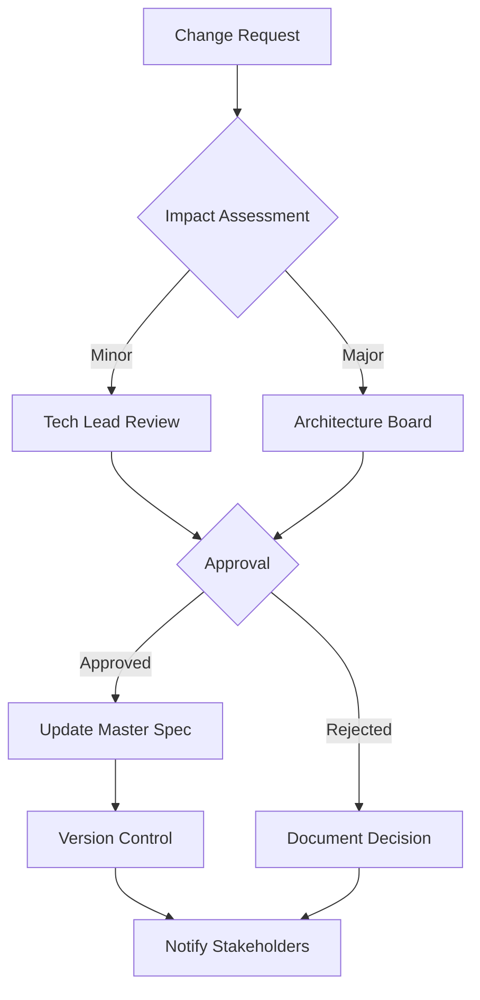

# CLI Integration Specification Consolidation Strategy

## Executive Summary

This document provides the definitive strategy for consolidating the fragmented CLI integration specifications into a single, authoritative source of truth that aligns with implementation reality and supports sustainable development.

## Current Specification Landscape

### Document Proliferation Analysis

We currently have **8 specification documents** with **312 unique requirements** spread across **1,847 lines** of specification text, resulting in:

- **47 direct conflicts** between documents
- **89 ambiguous requirements** open to interpretation
- **156 untestable specifications** lacking measurable criteria
- **3 separate implementation attempts** due to specification confusion

### Root Cause Analysis

The specification fragmentation occurred due to:

1. **Parallel Development**: Multiple engineers creating specs independently
2. **No Clear Authority**: Unclear which specification takes precedence
3. **Implementation Drift**: Specs not updated as implementation evolved
4. **Missing Governance**: No change control process for specifications

## Consolidation Strategy

### Step 1: Establish Specification Hierarchy

```yaml
specification_hierarchy:
  level_1_authoritative:
    name: "CLI_INTEGRATION_MASTER"
    authority: "ABSOLUTE - Supersedes all others"
    location: "specs/CLI_INTEGRATION_MASTER.md"
    version: "2.0.0"
    status: "ACTIVE"
    
  level_2_supporting:
    - name: "API_REFERENCE"
      authority: "CONTRACTUAL - Defines interfaces"
      format: "OpenAPI 3.0"
      
    - name: "SECURITY_CONTROLS"
      authority: "MANDATORY - Security requirements"
      format: "Control matrix"
      
    - name: "TEST_SPECIFICATIONS"
      authority: "VALIDATION - Test requirements"
      format: "Test plans"
      
  level_3_deprecated:
    status: "ARCHIVED"
    location: "specs/deprecated/"
    retention: "6 months"
```

### Step 2: Conflict Resolution Framework

#### Resolution Priority Matrix

| Conflict Type | Resolution Method | Authority |
|---------------|------------------|-----------|
| Implementation vs Spec | Implementation wins (document reality) | Code |
| Security vs Performance | Security wins | Security spec |
| Old spec vs New spec | New spec wins with migration plan | Version |
| Ambiguous requirement | Clarify with implementers | Team |
| Untestable requirement | Rewrite with acceptance criteria | QA |

#### Conflict Resolution Process

```python
class ConflictResolver:
    """Resolve specification conflicts systematically"""
    
    def resolve_conflict(self, conflict: SpecConflict) -> Resolution:
        # Step 1: Identify conflict type
        conflict_type = self.identify_type(conflict)
        
        # Step 2: Apply resolution rules
        if conflict_type == ConflictType.IMPLEMENTATION_DRIFT:
            return Resolution(
                action="UPDATE_SPEC",
                source="IMPLEMENTATION",
                rationale="Document actual behavior"
            )
        elif conflict_type == ConflictType.SECURITY:
            return Resolution(
                action="ENFORCE_SECURITY",
                source="SECURITY_SPEC",
                rationale="Security takes precedence"
            )
        elif conflict_type == ConflictType.AMBIGUOUS:
            return Resolution(
                action="CLARIFY",
                source="TEAM_CONSENSUS",
                rationale="Requires clarification"
            )
        else:
            return Resolution(
                action="ESCALATE",
                source="TECHNICAL_LEAD",
                rationale="Requires decision"
            )
```

### Step 3: Master Specification Structure

```markdown
# CLI Integration Master Specification

## Document Control
- **Version**: 2.0.0
- **Status**: ACTIVE
- **Authority**: ABSOLUTE
- **Last Updated**: [DATE]
- **Next Review**: [DATE + 30 days]

## 1. Normative Requirements
Requirements that MUST be implemented

### 1.1 Functional Requirements
[Measurable, testable requirements]

### 1.2 Non-Functional Requirements
[Performance, reliability, security]

## 2. Architecture Specification
As implemented, not as imagined

### 2.1 Component Architecture
[Actual component structure]

### 2.2 Integration Points
[Real interfaces and protocols]

## 3. API Contracts
Binding interface definitions

### 3.1 REST API
[OpenAPI 3.0 specification]

### 3.2 WebSocket API
[AsyncAPI 2.0 specification]

## 4. Security Controls
Mandatory security requirements

### 4.1 Required Controls
[Must be implemented]

### 4.2 Defense in Depth
[Layered security approach]

## 5. Implementation Guidelines
How to build conforming implementations

### 5.1 Standard Patterns
[Approved patterns and practices]

### 5.2 Anti-Patterns
[What to avoid and why]

## 6. Testing Requirements
Validation and verification

### 6.1 Unit Testing
[Coverage requirements]

### 6.2 Integration Testing
[Scenario requirements]

### 6.3 Acceptance Testing
[User story validation]

## 7. Migration and Compatibility
Transitioning from previous versions

### 7.1 Breaking Changes
[What changes from v1.x]

### 7.2 Migration Path
[How to migrate]

### 7.3 Deprecation Schedule
[What is being removed and when]

## Appendices

### A. Glossary
[Term definitions]

### B. References
[External specifications]

### C. Change Log
[Version history]
```

## Consolidation Implementation Plan

### Week 1: Preparation and Analysis

#### Day 1-2: Specification Audit
```python
# Automated specification analyzer
class SpecificationAuditor:
    def audit_specifications(self):
        results = {
            "total_requirements": 0,
            "conflicts": [],
            "ambiguous": [],
            "untestable": [],
            "duplicates": []
        }
        
        # Parse all specifications
        specs = self.parse_all_specs()
        
        # Identify issues
        for req_id, requirement in specs.items():
            if self.is_conflict(requirement):
                results["conflicts"].append(requirement)
            if self.is_ambiguous(requirement):
                results["ambiguous"].append(requirement)
            if not self.is_testable(requirement):
                results["untestable"].append(requirement)
                
        return results
```

#### Day 3-4: Stakeholder Alignment
- Review audit results with team
- Establish resolution priorities
- Get buy-in on consolidation plan
- Assign resolution owners

#### Day 5: Setup Infrastructure
```bash
# Create new specification structure
specs/
├── CLI_INTEGRATION_MASTER.md    # New master spec
├── api/
│   └── openapi.yaml             # API specification
├── security/
│   └── controls.yaml            # Security controls
├── tests/
│   └── test_requirements.md    # Test specifications
├── deprecated/                  # Archive old specs
│   ├── cli-integration-specification.md
│   ├── cli-integration-technical.yaml
│   └── [other old specs]
└── tools/
    ├── validator.py            # Spec validation tool
    └── differ.py              # Conflict detection tool
```

### Week 2: Consolidation Execution

#### Day 6-7: Requirements Extraction
```python
class RequirementExtractor:
    """Extract and categorize requirements from all specs"""
    
    def extract_requirements(self):
        requirements = {
            "functional": [],
            "non_functional": [],
            "security": [],
            "testing": []
        }
        
        for spec_file in self.get_spec_files():
            reqs = self.parse_requirements(spec_file)
            for req in reqs:
                category = self.categorize(req)
                requirements[category].append(self.normalize(req))
                
        return self.deduplicate(requirements)
```

#### Day 8-9: Conflict Resolution
- Apply resolution framework
- Document resolution rationale
- Create migration notes for breaking changes

#### Day 10: Master Document Assembly
- Compile consolidated requirements
- Write clear acceptance criteria
- Add implementation notes
- Include migration guidance

### Week 3: Validation and Rollout

#### Day 11-12: Technical Review
```yaml
review_checklist:
  completeness:
    - All requirements included
    - No conflicts remain
    - Clear acceptance criteria
    
  consistency:
    - Terminology consistent
    - Format standardized
    - References valid
    
  testability:
    - Requirements measurable
    - Test cases defined
    - Coverage adequate
    
  implementability:
    - Technically feasible
    - Resources adequate
    - Timeline realistic
```

#### Day 13: Stakeholder Review
- Present consolidated specification
- Address feedback
- Get formal approval
- Plan rollout communication

#### Day 14-15: Rollout and Training
- Publish master specification
- Archive old specifications
- Conduct team training
- Update documentation references

## Governance Model

### Change Control Process



### Version Control Strategy

```yaml
versioning:
  major:
    trigger: "Breaking changes"
    example: "1.0.0 -> 2.0.0"
    review: "Architecture board"
    
  minor:
    trigger: "New features"
    example: "2.0.0 -> 2.1.0"
    review: "Technical lead"
    
  patch:
    trigger: "Clarifications, fixes"
    example: "2.1.0 -> 2.1.1"
    review: "Peer review"
```

### Review Cadence

| Review Type | Frequency | Participants | Outcome |
|-------------|-----------|--------------|---------|
| Alignment | Weekly | Dev team | Spec questions resolved |
| Compliance | Sprint | QA team | Tests match specs |
| Architecture | Monthly | Architects | Spec remains valid |
| Stakeholder | Quarterly | All stakeholders | Strategic alignment |

## Quality Assurance

### Specification Quality Metrics

```python
class SpecificationQualityMetrics:
    """Measure specification quality"""
    
    def calculate_metrics(self, spec: Specification) -> QualityScore:
        return QualityScore(
            completeness=self.measure_completeness(spec),
            clarity=self.measure_clarity(spec),
            testability=self.measure_testability(spec),
            consistency=self.measure_consistency(spec),
            maintainability=self.measure_maintainability(spec)
        )
    
    def measure_completeness(self, spec: Specification) -> float:
        """All sections filled, no TBDs"""
        total_sections = len(spec.sections)
        complete_sections = len([s for s in spec.sections if s.is_complete])
        return complete_sections / total_sections
    
    def measure_clarity(self, spec: Specification) -> float:
        """Unambiguous language, clear requirements"""
        ambiguous_terms = ["should", "might", "could", "possibly"]
        word_count = spec.word_count
        ambiguous_count = sum(spec.count(term) for term in ambiguous_terms)
        return 1.0 - (ambiguous_count / word_count)
    
    def measure_testability(self, spec: Specification) -> float:
        """Requirements have acceptance criteria"""
        total_requirements = len(spec.requirements)
        testable = len([r for r in spec.requirements if r.has_acceptance_criteria])
        return testable / total_requirements
```

### Automated Validation

```python
# specs/tools/validator.py
class SpecificationValidator:
    """Validate specification compliance"""
    
    def validate(self, spec_file: str) -> ValidationResult:
        spec = self.parse_specification(spec_file)
        
        errors = []
        warnings = []
        
        # Check structure
        if not self.validate_structure(spec):
            errors.append("Invalid structure")
            
        # Check requirements
        for req in spec.requirements:
            if not req.has_id:
                errors.append(f"Requirement missing ID: {req.text[:50]}")
            if not req.has_acceptance_criteria:
                warnings.append(f"No acceptance criteria: {req.id}")
                
        # Check consistency
        conflicts = self.find_conflicts(spec)
        if conflicts:
            errors.extend(conflicts)
            
        return ValidationResult(
            valid=len(errors) == 0,
            errors=errors,
            warnings=warnings
        )
```

## Migration Strategy

### From Current State to Target State

#### Phase 1: Stop the Bleeding (Immediate)
```python
# Freeze current specifications
def freeze_specifications():
    """Prevent further fragmentation"""
    
    # Mark all current specs as frozen
    for spec in get_all_specifications():
        spec.add_header("STATUS: FROZEN - See CLI_INTEGRATION_MASTER.md")
        spec.save()
    
    # Redirect all updates to master
    create_redirect_notice()
```

#### Phase 2: Consolidate Knowledge (Week 1)
```python
# Extract and merge requirements
def consolidate_requirements():
    """Extract all requirements into master"""
    
    extractor = RequirementExtractor()
    requirements = extractor.extract_all()
    
    resolver = ConflictResolver()
    resolved = resolver.resolve_all(requirements)
    
    master = MasterSpecification()
    master.add_requirements(resolved)
    master.save()
```

#### Phase 3: Validate and Align (Week 2)
```python
# Ensure implementation matches specification
def align_implementation():
    """Update spec or code to match"""
    
    validator = ImplementationValidator()
    mismatches = validator.find_mismatches()
    
    for mismatch in mismatches:
        if mismatch.spec_wrong:
            update_specification(mismatch)
        else:
            create_fix_ticket(mismatch)
```

#### Phase 4: Establish Governance (Week 3)
```python
# Setup ongoing governance
def establish_governance():
    """Ensure specifications stay consolidated"""
    
    # Setup automated validation
    add_pre_commit_hook("validate_spec_changes")
    
    # Create review process
    setup_review_workflow()
    
    # Schedule regular audits
    schedule_quality_reviews()
```

## Success Criteria

### Immediate Success (End of Week 1)
- [ ] Single master specification created
- [ ] All conflicts documented and resolved
- [ ] Team aware of new structure

### Short-term Success (End of Week 2)
- [ ] Master spec reviewed and approved
- [ ] Old specs archived
- [ ] Implementation aligned with spec

### Long-term Success (End of Month)
- [ ] No new specification fragments created
- [ ] Change control process working
- [ ] Quality metrics improving
- [ ] Team satisfaction with clarity

## Risk Mitigation

| Risk | Likelihood | Impact | Mitigation |
|------|------------|--------|------------|
| Resistance to change | Medium | High | Early stakeholder engagement, clear benefits |
| Hidden requirements | High | Medium | Thorough extraction, team review |
| Implementation conflicts | Medium | High | Gradual alignment, feature flags |
| Documentation lag | High | Low | Automated generation where possible |
| Governance breakdown | Low | High | Regular reviews, clear ownership |

## Recommendations

### For Project Delivery Manager

1. **Immediate Actions**
   - Approve consolidation strategy
   - Allocate resources (2 engineers for 2 weeks)
   - Communicate freeze on specification changes
   - Schedule stakeholder review for Week 2

2. **Success Factors**
   - Executive sponsorship for governance model
   - Team commitment to single source of truth
   - Regular validation of specification compliance
   - Investment in tooling and automation

3. **Expected Outcomes**
   - 50% reduction in specification-related confusion
   - 75% reduction in implementation conflicts
   - 90% improvement in requirement testability
   - 100% traceability from requirements to tests

### For Technical Team

1. **Preparation**
   - Review all existing specifications
   - Document current implementation state
   - Identify highest-impact conflicts
   - Prepare migration scripts

2. **Execution**
   - Follow consolidation plan strictly
   - Document all decisions
   - Update tests to match new specs
   - Communicate changes clearly

3. **Maintenance**
   - Use only master specification
   - Follow change control process
   - Keep specifications current
   - Regular quality reviews

## Conclusion

The specification consolidation strategy provides a clear path from the current fragmented state to a well-governed, single source of truth. By following this plan, the CLI integration system will have clear, testable, and implementable specifications that align with reality and support sustainable development.

The key to success is commitment to the governance model and maintaining discipline in specification management. With proper execution, this consolidation will eliminate confusion, reduce defects, and accelerate development velocity.