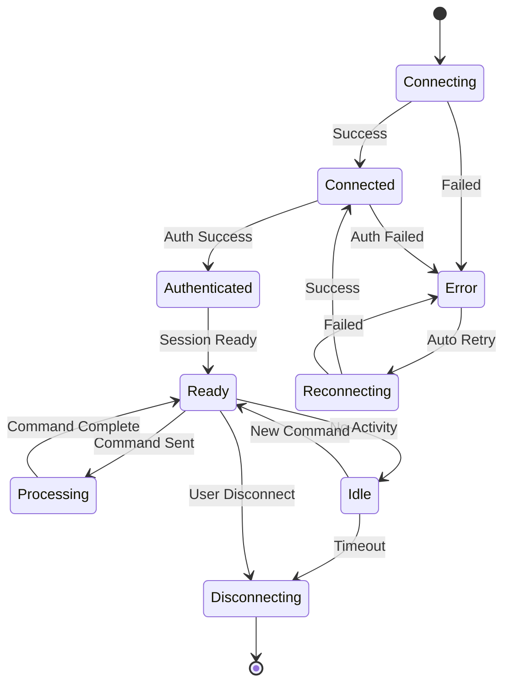

# CLI Integration API Specification

## RESTful API Endpoints

### Session Management

#### POST /api/cli/sessions
Create a new CLI session.

**Request Body:**
```json
{
  "cli_tool": "claude|codex|gemini|cursor|bash",
  "mode": "cli|interactive|api",               // Optional (default: "cli")
  "cwd": "/path/to/project",                   // Optional
  "full_access": false,                          // Optional
  "model": "claude-3-5-sonnet-latest",         // Optional
  "metadata": {                                  // Optional
    "taskId": "TSK-1234",
    "role": "backend"
  }
}
```

**Response (201 Created):**
```json
{
  "sessionId": "550e8400-e29b-41d4-a716-446655440000",
  "cli_tool": "claude",
  "mode": "cli",
  "status": "initializing",
  "createdAt": "2024-01-15T09:30:00Z",
  "websocketUrl": "ws://localhost:8000/ws/cli/550e8400-e29b-41d4-a716-446655440000"
}
```

**Error Responses:**
- `400 Bad Request`: Invalid provider or configuration
- `403 Forbidden`: User lacks permission for requested provider/mode
- `429 Too Many Requests`: Session limit exceeded
- `503 Service Unavailable`: Provider temporarily unavailable

---

#### GET /api/cli/sessions
List all active sessions for the current user.

**Query Parameters:**
- `provider` (optional): Filter by provider
- `status` (optional): Filter by status
- `limit` (optional, default: 20): Maximum results
- `offset` (optional, default: 0): Pagination offset

**Response (200 OK):**
```json
{
  "sessions": [
    {
      "sessionId": "550e8400-e29b-41d4-a716-446655440000",
      "provider": "claude",
      "model": "claude-3-5-sonnet-latest",
      "status": "ready",
      "createdAt": "2024-01-15T09:30:00Z",
      "lastActivity": "2024-01-15T09:35:00Z",
      "metadata": {
        "taskId": "TSK-1234",
        "role": "backend"
      }
    }
  ],
  "total": 5,
  "limit": 20,
  "offset": 0
}
```

---

#### GET /api/cli/sessions/{sessionId}
Get details of a specific session.

**Response (200 OK):**
```json
{
  "sessionId": "550e8400-e29b-41d4-a716-446655440000",
  "cli_tool": "claude",
  "mode": "cli",
  "status": "ready",
  "processId": 12345,
  "createdAt": "2024-01-15T09:30:00Z",
  "lastActivity": "2024-01-15T09:35:00Z",
  "statistics": {
    "messagesExchanged": 10,
    "bytesTransferred": 5120,
    "cpuTimeSeconds": 2.5,
    "memoryUsageMB": 45
  },
  "metadata": {
    "taskId": "TSK-1234",
    "role": "backend"
  }
}
```

**Error Responses:**
- `404 Not Found`: Session does not exist
- `403 Forbidden`: User lacks access to this session

---

#### DELETE /api/cli/sessions/{sessionId}
Terminate a CLI session.

**Response (204 No Content):** Success

**Error Responses:**
- `404 Not Found`: Session does not exist
- `403 Forbidden`: User lacks permission to terminate session

---

#### POST /api/cli/sessions/{sessionId}/interrupt
Send interrupt signal (Ctrl+C) to CLI process.

**Response (200 OK):**
```json
{
  "success": true,
  "message": "Interrupt signal sent"
}
```

---

### Session History

#### GET /api/cli/sessions/{sessionId}/history
Retrieve command history for a session.

**Query Parameters:**
- `limit` (optional, default: 100): Maximum messages
- `before` (optional): ISO8601 timestamp for pagination
- `after` (optional): ISO8601 timestamp for pagination

**Response (200 OK):**
```json
{
  "sessionId": "550e8400-e29b-41d4-a716-446655440000",
  "history": [
    {
      "id": "msg-001",
      "type": "command",
      "timestamp": "2024-01-15T09:30:00Z",
      "content": "Analyze the authentication module",
      "metadata": {}
    },
    {
      "id": "msg-002",
      "type": "output",
      "timestamp": "2024-01-15T09:30:02Z",
      "content": "Analyzing authentication module...\n",
      "metadata": {
        "streamChunk": true
      }
    }
  ],
  "hasMore": false
}
```

---

### Provider Management

#### GET /api/cli/providers
List available CLI providers and their status.

**Response (200 OK):**
```json
{
  "providers": [
    {
      "name": "claude",
      "displayName": "Claude CLI",
      "type": "cli",
      "available": true,
      "models": [
        "claude-3-5-sonnet-latest",
        "claude-3-opus-latest"
      ],
      "capabilities": [
        "code-generation",
        "analysis",
        "full-access"
      ],
      "status": {
        "healthy": true,
        "binaryPath": "/usr/local/bin/claude",
        "version": "1.2.3",
        "lastCheck": "2024-01-15T09:30:00Z"
      }
    },
    {
      "name": "codex",
      "displayName": "Codex CLI",
      "type": "cli",
      "available": true,
      "models": ["default"],
      "capabilities": [
        "code-generation",
        "execution",
        "full-access"
      ],
      "status": {
        "healthy": true,
        "binaryPath": "/usr/local/bin/codex",
        "version": "2.1.0",
        "lastCheck": "2024-01-15T09:30:00Z"
      }
    }
  ]
}
```

---

#### GET /api/cli/providers/{provider}/health
Check health status of a specific provider.

**Response (200 OK):**
```json
{
  "provider": "claude",
  "healthy": true,
  "checks": {
    "binaryExists": true,
    "binaryExecutable": true,
    "environmentVariables": true,
    "testExecution": true
  },
  "details": {
    "binaryPath": "/usr/local/bin/claude",
    "version": "1.2.3",
    "lastSuccessfulExecution": "2024-01-15T09:25:00Z",
    "averageResponseTime": 1.2
  }
}
```

---

### System Status

#### GET /api/cli/status
Get overall CLI system status.

**Response (200 OK):**
```json
{
  "status": "healthy",
  "activeSessions": 5,
  "activeProcesses": 5,
  "resources": {
    "processLimit": 20,
    "processesUsed": 5,
    "memoryLimitMB": 2048,
    "memoryUsedMB": 225,
    "cpuLimitPercent": 50,
    "cpuUsedPercent": 12
  },
  "statistics": {
    "totalSessionsCreated": 150,
    "totalCommandsProcessed": 1200,
    "averageSessionDurationMinutes": 15,
    "errorRate": 0.02
  },
  "uptime": {
    "startedAt": "2024-01-15T00:00:00Z",
    "uptimeSeconds": 34200
  }
}
```

---

## WebSocket API

### Connection

#### Endpoint: /ws/cli/{sessionId}

**Connection URL:**
```
ws://localhost:8000/ws/cli/550e8400-e29b-41d4-a716-446655440000?token=JWT_TOKEN
```

**Connection Headers:**
```
Authorization: Bearer JWT_TOKEN
Sec-WebSocket-Protocol: cli.v1
```

### Message Protocol

#### Client to Server Messages

##### Command Message
Send a command to the CLI.

```json
{
  "type": "command",
  "id": "cmd-123",  // Client-generated ID for tracking
  "data": {
    "command": "Analyze the authentication module and suggest improvements",
    "options": {
      "timeout": 30000,  // Optional, milliseconds
      "format": "markdown"  // Optional
    }
  }
}
```

##### Cancel Message
Cancel current operation.

```json
{
  "type": "cancel",
  "id": "cancel-456",
  "data": {}
}
```

##### Status Request
Request current session status.

```json
{
  "type": "status",
  "id": "status-789",
  "data": {}
}
```

##### Ping Message
Keep connection alive.

```json
{
  "type": "ping",
  "id": "ping-000",
  "data": {
    "timestamp": "2024-01-15T09:30:00Z"
  }
}
```

---

#### Server to Client Messages

##### Output Message
CLI output stream.

```json
{
  "type": "output",
  "id": "out-123",
  "correlationId": "cmd-123",  // References original command
  "timestamp": "2024-01-15T09:30:00Z",
  "data": {
    "content": "Analyzing authentication module...\n",
    "stream": "stdout",  // stdout or stderr
    "metadata": {
      "isPartial": false,  // True if line incomplete
      "format": "text",  // text, json, markdown
      "ansiCodes": false  // True if contains ANSI codes
    }
  }
}
```

##### Status Message
Session status update.

```json
{
  "type": "status",
  "id": "status-123",
  "timestamp": "2024-01-15T09:30:00Z",
  "data": {
    "status": "processing",  // initializing, ready, processing, idle, error
    "details": {
      "processId": 12345,
      "memoryUsageMB": 45,
      "cpuPercent": 5.2
    }
  }
}
```

##### Error Message
Error notification.

```json
{
  "type": "error",
  "id": "err-123",
  "correlationId": "cmd-123",
  "timestamp": "2024-01-15T09:30:00Z",
  "data": {
    "code": "PROCESS_TIMEOUT",
    "message": "Command execution timed out after 30 seconds",
    "details": {
      "timeout": 30000,
      "command": "complex_analysis"
    },
    "recoverable": true
  }
}
```

##### Completion Message
Command completion notification.

```json
{
  "type": "completion",
  "id": "complete-123",
  "correlationId": "cmd-123",
  "timestamp": "2024-01-15T09:30:00Z",
  "data": {
    "success": true,
    "duration": 2500,  // milliseconds
    "statistics": {
      "tokensUsed": 1500,
      "bytesTransferred": 5120
    }
  }
}
```

##### Pong Message
Response to ping.

```json
{
  "type": "pong",
  "id": "pong-000",
  "correlationId": "ping-000",
  "timestamp": "2024-01-15T09:30:00Z",
  "data": {
    "serverTime": "2024-01-15T09:30:00Z",
    "latency": 15  // milliseconds
  }
}
```

---

### WebSocket Connection States



---

## Error Codes

### HTTP Status Codes
- `200 OK`: Success
- `201 Created`: Resource created
- `204 No Content`: Success with no response body
- `400 Bad Request`: Invalid request parameters
- `401 Unauthorized`: Authentication required
- `403 Forbidden`: Insufficient permissions
- `404 Not Found`: Resource not found
- `429 Too Many Requests`: Rate limit exceeded
- `500 Internal Server Error`: Server error
- `503 Service Unavailable`: Service temporarily down

### WebSocket Error Codes
- `INVALID_MESSAGE`: Malformed message format
- `UNKNOWN_MESSAGE_TYPE`: Unrecognized message type
- `SESSION_NOT_FOUND`: Session does not exist
- `SESSION_EXPIRED`: Session has expired
- `PROCESS_SPAWN_FAILED`: Failed to start CLI process
- `PROCESS_DEAD`: CLI process terminated unexpectedly
- `PROCESS_TIMEOUT`: Command execution timeout
- `RATE_LIMIT`: Too many messages
- `AUTHENTICATION_FAILED`: Invalid or expired token
- `PERMISSION_DENIED`: Insufficient permissions
- `PROVIDER_UNAVAILABLE`: CLI provider not available
- `RESOURCE_EXHAUSTED`: System resource limits reached

---

## Rate Limiting

### Limits
- Session creation: 10 per minute per user
- Commands: 60 per minute per session
- WebSocket messages: 100 per minute per connection
- API requests: 300 per minute per user

### Headers
Response includes rate limit information:
```
X-RateLimit-Limit: 60
X-RateLimit-Remaining: 45
X-RateLimit-Reset: 1705315200
```

### Rate Limit Response
```json
{
  "error": "RATE_LIMIT_EXCEEDED",
  "message": "Rate limit exceeded. Try again in 30 seconds.",
  "retryAfter": 30,
  "limit": 60,
  "window": "1m",
  "resetAt": "2024-01-15T09:31:00Z"
}
```

---

## Authentication

### JWT Token Structure
```json
{
  "sub": "user-123",
  "exp": 1705315200,
  "iat": 1705311600,
  "permissions": [
    "cli:use",
    "cli:full_access"
  ],
  "roles": ["developer"],
  "sessionLimit": 10
}
```

### Token Validation
- Algorithm: RS256
- Expiration: 1 hour
- Refresh available via `/api/auth/refresh`
- Required for both REST and WebSocket

---

## SDK Examples

### JavaScript/TypeScript
```typescript
// Initialize client
const cliClient = new CLIClient({
  baseUrl: 'http://localhost:8000',
  token: authToken
});

// Create session
const session = await cliClient.createSession({
  provider: 'claude',
  model: 'claude-3-5-sonnet-latest'
});

// Connect WebSocket
await session.connect();

// Send command
session.on('output', (data) => {
  console.log(data.content);
});

await session.sendCommand('Analyze this code for security issues');

// Cleanup
await session.disconnect();
```

### Python
```python
# Initialize client
cli_client = CLIClient(
    base_url='http://localhost:8000',
    token=auth_token
)

# Create session
session = await cli_client.create_session(
    provider='claude',
    model='claude-3-5-sonnet-latest'
)

# Connect WebSocket
await session.connect()

# Send command
async for output in session.stream_command('Analyze this code'):
    print(output.content)

# Cleanup
await session.disconnect()
```

---

## Additional Implemented Endpoints (Current Backend)

- `GET /api/cli/sessions` — List active CLI sessions
- `GET /api/cli/sessions/{session_id}` — Session details
- `POST /api/cli/sessions/{session_id}/input` — Send input to a session (HTTP alternative to WebSocket)
- `POST /api/cli/sessions/{session_id}/terminate` and `DELETE /api/cli/sessions/{session_id}` — Terminate a session
- `GET /api/cli/sessions/metrics` — Aggregated session metrics
- `POST /api/cli/sessions/recover` — Recover interrupted sessions
- `GET /api/cli/providers` — List providers and availability
- `GET /api/cli/providers/{provider}/health` — Provider binary health (binary presence, exec, version)
- `POST /api/cli/sessions/{session_id}/interrupt` — Send Ctrl+C to running session
- Auth utility endpoints:
  - `POST /api/auth/login`
  - `POST /api/auth/verify`
  - `POST /api/auth/revoke`
  - `GET  /api/auth/sessions`

Note: A dedicated interrupt endpoint (e.g., `POST /api/cli/sessions/{session_id}/interrupt`) is planned and can be added to send an interrupt signal to the underlying PTY process.
