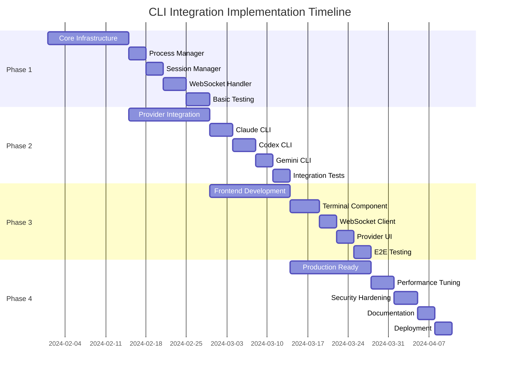

# CLI Integration Implementation Roadmap

## Executive Summary

This roadmap outlines the phased implementation approach for integrating real CLI tools (claude, codex, gemini) into the AutoDev dashboard. The implementation is structured in 4 major phases over 8 weeks, with clear milestones and deliverables.

## Timeline Overview



## Phase 1: Core Infrastructure (Weeks 1-2)

### Goals
Establish the foundational backend components for CLI process management and WebSocket communication.

### Week 1: Backend Foundation

#### Day 1-2: Project Setup & Architecture
**Tasks:**
- [ ] Create project structure and directories
- [ ] Set up development environment
- [ ] Configure Docker containers for testing
- [ ] Initialize database schemas

**Deliverables:**
- Project skeleton with proper structure
- Development environment documentation
- Docker compose configuration

#### Day 3-5: Process Manager Implementation
**Tasks:**
- [ ] Implement `CLIProcessManager` class
- [ ] Add process spawning logic
- [ ] Implement process pool management
- [ ] Add resource limit enforcement

**Code Structure:**
```python
orchestrator/
├── cli/
│   ├── __init__.py
│   ├── process_manager.py
│   ├── exceptions.py
│   └── utils.py
```

**Acceptance Criteria:**
- Can spawn CLI processes with proper isolation
- Resource limits enforced (memory, CPU, process count)
- Process lifecycle properly managed

### Week 2: Communication Layer

#### Day 6-8: WebSocket Handler
**Tasks:**
- [ ] Implement WebSocket endpoint
- [ ] Add message parsing and routing
- [ ] Implement output streaming
- [ ] Add connection management

**API Endpoints:**
```
POST   /api/cli/sessions
GET    /api/cli/sessions
GET    /api/cli/sessions/{id}
DELETE /api/cli/sessions/{id}
WS     /ws/cli/{session_id}
```

#### Day 9-10: Session Management
**Tasks:**
- [ ] Implement `CLISessionManager` class
- [ ] Add Redis persistence
- [ ] Implement session recovery
- [ ] Add session state machine

**Data Models:**
```python
class Session:
    id: str
    provider: str
    process_id: Optional[int]
    status: SessionStatus
    created_at: datetime
    metadata: Dict[str, Any]
```

#### Day 11-14: Testing & Documentation
**Tasks:**
- [ ] Write unit tests for all components
- [ ] Create integration test suite
- [ ] Document API endpoints
- [ ] Code review and refactoring

**Test Coverage Target:** 80%

## Phase 2: Provider Integration (Weeks 3-4)

### Goals
Integrate all three CLI providers with proper configuration and error handling.

### Week 3: CLI Provider Implementation

#### Day 15-17: Claude CLI Integration
**Tasks:**
- [ ] Implement Claude provider adapter
- [ ] Add full-access mode support
- [ ] Handle Claude-specific output formats
- [ ] Add error recovery logic

**Configuration:**
```yaml
providers:
  claude_cli:
    binary: "claude"
    args_interactive: ["--dangerously-skip-permissions"]
    args_standard: ["-p", "--output-format", "json"]
```

#### Day 18-20: Codex CLI Integration
**Tasks:**
- [ ] Implement Codex provider adapter
- [ ] Add sandbox mode configuration
- [ ] Handle interactive mode
- [ ] Implement approval bypass

**Configuration:**
```yaml
providers:
  codex_cli:
    binary: "codex"
    args: ["--ask-for-approval", "never", "--sandbox", "danger-full-access"]
```

#### Day 21-22: Gemini CLI Integration
**Tasks:**
- [ ] Implement Gemini provider adapter
- [ ] Add model selection support
- [ ] Handle API fallback
- [ ] Configure output formatting

### Week 4: Provider Testing & Optimization

#### Day 23-25: Integration Testing
**Tasks:**
- [ ] Test each provider individually
- [ ] Test provider switching
- [ ] Test error scenarios
- [ ] Performance benchmarking
- [ ] Implement provider health endpoint (`GET /api/cli/providers/{provider}/health`)

**Test Matrix:**
| Provider | Basic | Full Access | Streaming | Error Recovery |
|----------|-------|------------|-----------|----------------|
| Claude   | ✓     | ✓          | ✓         | ✓              |
| Codex    | ✓     | ✓          | ✓         | ✓              |
| Gemini   | ✓     | ✗          | ✓         | ✓              |

#### Day 26-28: Provider Optimization
**Tasks:**
- [ ] Optimize process spawning time
- [ ] Implement process pooling
- [ ] Add provider health checks
- [ ] Implement fallback mechanisms

## Phase 3: Frontend Development (Weeks 5-6)

### Goals
Build the user interface components for CLI interaction in the dashboard.

### Week 5: Terminal Component

#### Day 29-32: Terminal Implementation
**Tasks:**
- [ ] Integrate xterm.js library
- [ ] Implement terminal rendering
- [ ] Add ANSI color support
- [ ] Implement copy/paste functionality
- [ ] Note: Current UI uses `dashboard/dashboard.html` (React UMD); TS/React componentization planned

**Component Structure:**
```typescript
dashboard/
├── components/
│   ├── CLITerminal/
│   │   ├── CLITerminal.tsx
│   │   ├── CLITerminal.css
│   │   ├── hooks/
│   │   │   ├── useTerminal.ts
│   │   │   └── useWebSocket.ts
│   │   └── utils/
│   │       ├── ansiParser.ts
│   │       └── commandHistory.ts
```

#### Day 33-35: WebSocket Client
**Tasks:**
- [ ] Implement WebSocket client class
- [ ] Add automatic reconnection
- [ ] Implement message queuing
- [ ] Add error handling

**Features:**
- Exponential backoff for reconnection
- Message buffering during disconnect
- Heartbeat mechanism
- Connection state management

### Week 6: UI Integration

#### Day 36-38: Provider Selection UI
**Tasks:**
- [ ] Build provider selector component
- [ ] Add model selection dropdown
- [ ] Implement status indicators
- [ ] Add settings panel

**UI Components:**
```jsx
<ProviderSelector>
  <ProviderCard provider="claude" status="available" />
  <ProviderCard provider="codex" status="available" />
  <ProviderCard provider="gemini" status="unavailable" />
</ProviderSelector>
```

#### Day 39-40: Session Management UI
**Tasks:**
- [ ] Build session list component
- [ ] Add session switching
- [ ] Implement history viewer
- [ ] Add session controls

#### Day 41-42: End-to-End Testing
**Tasks:**
- [ ] Write E2E test scenarios
- [ ] Test complete user workflows
- [ ] Performance testing
- [ ] Accessibility testing

## Phase 4: Production Readiness (Weeks 7-8)

### Goals
Prepare the system for production deployment with optimization, security, and documentation.

### Week 7: Optimization & Security

#### Day 43-45: Performance Optimization
**Tasks:**
- [ ] Profile and optimize hot paths
- [ ] Implement caching strategies
- [ ] Optimize WebSocket messaging
- [ ] Database query optimization

**Performance Targets:**
- Process spawn: < 2s
- First byte: < 500ms
- Stream latency: < 100ms
- 10 concurrent sessions stable

#### Day 46-48: Security Hardening
**Tasks:**
- [ ] Security audit
- [ ] Input validation enhancement
- [ ] Rate limiting implementation
- [ ] Authentication strengthening

**Security Checklist:**
- [ ] No shell injection vulnerabilities
- [ ] Process isolation verified
- [ ] Resource limits enforced
- [ ] Token validation secure
- [ ] Rate limiting active

### Week 8: Documentation & Deployment

#### Day 49-51: Documentation
**Tasks:**
- [ ] API documentation
- [ ] User guide
- [ ] Administrator guide
- [ ] Troubleshooting guide

**Documentation Deliverables:**
- OpenAPI specification
- User workflow tutorials
- Video demonstrations
- FAQ section

#### Day 52-54: Deployment Preparation
**Tasks:**
- [ ] Create deployment scripts
- [ ] Configure monitoring
- [ ] Set up alerting
- [ ] Prepare rollback plan

**Deployment Checklist:**
- [ ] Docker images built
- [ ] Environment variables configured
- [ ] Monitoring dashboards ready
- [ ] Backup strategy defined
- [ ] Rollback procedure documented

#### Day 55-56: Production Deployment
**Tasks:**
- [ ] Deploy to staging environment
- [ ] Conduct final testing
- [ ] Deploy to production
- [ ] Monitor initial usage

## Milestone Deliverables

### Milestone 1 (End of Phase 1)
- Core backend infrastructure operational
- Process management working
- WebSocket communication established
- Basic API endpoints functional
- 80% unit test coverage

### Milestone 2 (End of Phase 2)
- All three CLI providers integrated
- Provider switching functional
- Error handling robust
- Integration tests passing
- Performance benchmarks met

### Milestone 3 (End of Phase 3)
- Terminal component complete
- WebSocket client stable
- Provider UI functional
- End-to-end tests passing
- User workflows validated

### Milestone 4 (End of Phase 4)
- System performance optimized
- Security audit passed
- Documentation complete
- Production deployment successful
- Monitoring active

## Risk Management

### High Priority Risks

#### Risk: CLI Binary Compatibility
**Probability:** Medium  
**Impact:** High  
**Mitigation:**
- Test with multiple CLI versions
- Implement version detection
- Create compatibility matrix
- Provide fallback options

#### Risk: Performance Degradation
**Probability:** Medium  
**Impact:** Medium  
**Mitigation:**
- Implement process pooling
- Add caching layers
- Monitor resource usage
- Auto-scaling capabilities

#### Risk: Security Vulnerabilities
**Probability:** Low  
**Impact:** High  
**Mitigation:**
- Regular security audits
- Input sanitization
- Process isolation
- Principle of least privilege

### Medium Priority Risks

#### Risk: WebSocket Stability
**Probability:** Medium  
**Impact:** Medium  
**Mitigation:**
- Robust reconnection logic
- Message queuing
- Health checks
- Fallback to polling

#### Risk: Provider API Changes
**Probability:** Low  
**Impact:** Medium  
**Mitigation:**
- Abstract provider interface
- Version pinning
- Regular compatibility testing
- Maintain provider adapters

## Success Metrics

### Technical Metrics
- **Availability:** 99.9% uptime
- **Performance:** All benchmarks met
- **Security:** Zero critical vulnerabilities
- **Test Coverage:** > 80% overall

### Business Metrics
- **User Adoption:** 80% of developers using within 1 month
- **User Satisfaction:** > 4.5/5 rating
- **Productivity:** 30% reduction in task completion time
- **Reliability:** < 1% error rate

### Quality Metrics
- **Code Coverage:** 80% minimum
- **Documentation:** 100% API coverage
- **Bug Rate:** < 5 bugs per 1000 lines
- **Technical Debt:** < 10% of codebase

## Resource Requirements

### Team Composition
- **Backend Developer:** 1 FTE for 8 weeks
- **Frontend Developer:** 1 FTE for 4 weeks (Weeks 5-8)
- **DevOps Engineer:** 0.5 FTE for 8 weeks
- **QA Engineer:** 0.5 FTE for 8 weeks
- **Technical Writer:** 0.25 FTE for 2 weeks (Weeks 7-8)

### Infrastructure
- **Development:** 
  - 3 development machines
  - CI/CD pipeline
  - Test environment
  
- **Staging:**
  - 2 application servers
  - 1 Redis instance
  - Monitoring stack
  
- **Production:**
  - 4 application servers
  - 2 Redis instances (primary/replica)
  - Load balancer
  - Monitoring and alerting

### Tools & Services
- GitHub for version control
- Jenkins/GitLab CI for CI/CD
- Prometheus/Grafana for monitoring
- Sentry for error tracking
- Datadog for APM

## Communication Plan

### Stakeholder Updates
- **Weekly:** Development team standup
- **Bi-weekly:** Stakeholder progress report
- **Phase Completion:** Milestone demonstration
- **Final:** Launch presentation

### Documentation
- **Daily:** Development logs
- **Weekly:** Progress reports
- **Phase-end:** Technical documentation
- **Project-end:** Complete documentation package

### Feedback Loops
- **Continuous:** Developer feedback via Slack
- **Weekly:** User testing sessions
- **Phase-end:** Stakeholder review
- **Post-launch:** User satisfaction survey

## Post-Launch Plan

### Week 9-10: Stabilization
- Monitor production metrics
- Address critical bugs
- Gather user feedback
- Performance tuning

### Week 11-12: Enhancement
- Implement user-requested features
- Optimize based on usage patterns
- Expand provider support
- Enhanced monitoring

### Long-term Roadmap
- Additional CLI tool support
- Advanced debugging features
- Collaborative sessions
- AI-powered command suggestions
- Custom provider plugins
